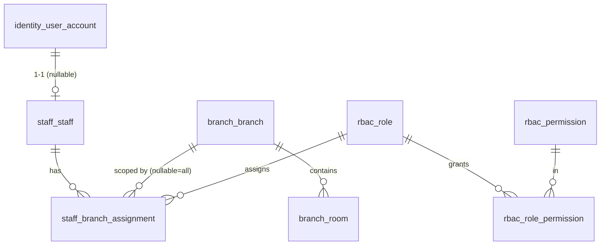

# P1 — Identity, RBAC, Branch, Staff

Nền tảng tổ chức: tài khoản đăng nhập, vai trò/quyền, chi nhánh + phòng, nhân sự + phân công theo chi nhánh.
Nguồn: `modules/staff-rbac.md`, `business/domain-map.md`, `business/business-rules.md` (BR-004), `status-flow.md`.

## Phạm vi P1

- `identity_user_account` — tài khoản đăng nhập (dùng chung cho staff; member dùng lại ở P2).
- `rbac_role`, `rbac_permission`, `rbac_role_permission` — vai trò & quyền.
- `branch_branch`, `branch_room` — chi nhánh & phòng (phòng vật lý dùng lại cho booking ở P5/P6).
- `staff_staff`, `staff_branch_assignment` — nhân sự & gán vai trò theo chi nhánh.

## ERD

---

## Bảng chi tiết

### `identity_user_account`
> ⚠️ **REVISED by ADR-0006 (Keycloak).** Authentication moved to Keycloak — app DB no longer stores passwords. This table becomes a thin mapping between an internal principal and the Keycloak user. See [`solution-architecture.md`](../solution-architecture.md) §5.

Ánh xạ định danh nội bộ ↔ Keycloak. Trung lập module — staff (P1) và member (P2) đều liên kết tới đây.

| Cột | Kiểu | Ràng buộc | Ghi chú |
|---|---|---|---|
| id | BIGINT | PK, identity | principal nội bộ ổn định, dùng cho FK |
| keycloak_user_id | UUID | UNIQUE, NOT NULL | `sub` trong JWT của Keycloak |
| account_type | VARCHAR(20) | NOT NULL, CHECK IN ('STAFF','MEMBER') | phân loại principal |
| username | VARCHAR(100) | UNIQUE, NULL | bản sao tiện tra cứu (nguồn chuẩn ở Keycloak) |
| email | VARCHAR(255) | partial UNIQUE khi NOT NULL | bản sao tiện tra cứu |
| status | VARCHAR(20) | NOT NULL DEFAULT 'ACTIVE', CHECK IN ('ACTIVE','DISABLED','LOCKED') | đồng bộ/mirror trạng thái Keycloak |
| last_login_at | timestamptz | NULL | |
| created_at | timestamptz | NOT NULL DEFAULT now() | |
| updated_at | timestamptz | NOT NULL DEFAULT now() | trigger |

- **Không có `password_hash`** (Keycloak quản lý credential).
- Index: `UNIQUE(keycloak_user_id)`; `UNIQUE(username) WHERE username IS NOT NULL`; partial `UNIQUE(email) WHERE email IS NOT NULL`.
- `rbac_*` + `staff_branch_assignment` bên dưới **giữ nguyên** — đây là phân quyền theo chi nhánh phía app (Keycloak không thay thế).

---

### `rbac_role`
Vai trò. Seed 15 role từ `staff-rbac.md`.

| Cột | Kiểu | Ràng buộc | Ghi chú |
|---|---|---|---|
| id | BIGINT | PK, identity | |
| code | VARCHAR(50) | UNIQUE, NOT NULL | `SUPER_ADMIN`, `OPERATION_MANAGER`, `BRANCH_MANAGER`, `RECEPTIONIST`, `SALES`, `CUSTOMER_CARE`, `PERSONAL_TRAINER`, `CLASS_INSTRUCTOR`, `MASSAGE_STAFF`, `CLEANER`, `PARKING_STAFF`, `MAINTENANCE_STAFF`, `ACCOUNTANT`, `MARKETING_STAFF`, `PARTNER_MANAGER` |
| name | VARCHAR(100) | NOT NULL | |
| description | TEXT | NULL | |
| scope | VARCHAR(20) | NOT NULL DEFAULT 'BRANCH', CHECK IN ('GLOBAL','BRANCH') | `GLOBAL` = áp toàn hệ thống (Super Admin, Operation Manager) |
| is_system | BOOLEAN | NOT NULL DEFAULT false | role hệ thống, chặn xóa |
| created_at / updated_at | timestamptz | NOT NULL DEFAULT now() | trigger |

### `rbac_permission`
Quyền hạt mịn. Seed dần theo từng module (P1 seed quyền cơ bản).

| Cột | Kiểu | Ràng buộc | Ghi chú |
|---|---|---|---|
| id | BIGINT | PK, identity | |
| code | VARCHAR(80) | UNIQUE, NOT NULL | vd `MEMBER_CREATE`, `MEMBER_VIEW_FULL_CCCD`, `KYC_APPROVE`, `PACKAGE_SELL`, `POS_SELL`, `CHECKIN_SUPPORT`, `BOOKING_MANAGE`, `RATING_VIEW_AUTHOR`, `MAINTENANCE_MANAGE` |
| module | VARCHAR(50) | NULL | gom nhóm: `member`, `kyc`, `booking`... |
| description | TEXT | NULL | |
| created_at / updated_at | timestamptz | NOT NULL DEFAULT now() | trigger |

> `RATING_VIEW_AUTHOR` hiện thực hóa rule: **PT không xem được tác giả rating, Manager thì có** (staff-rbac.md).
> `MEMBER_VIEW_FULL_CCCD` hiện thực hóa rule: **CCCD không lộ đầy đủ cho role không có quyền** (member-kyc.md).

### `rbac_role_permission`
Bảng nối role ↔ permission (N-N).

| Cột | Kiểu | Ràng buộc |
|---|---|---|
| role_id | BIGINT | FK → rbac_role(id) ON DELETE CASCADE |
| permission_id | BIGINT | FK → rbac_permission(id) ON DELETE CASCADE |
| | | PK(role_id, permission_id) |

- Index: `(permission_id)` để tra ngược.

---

### `branch_branch`
Chi nhánh. Phục vụ BR-004 (home/sale/check-in branch tách biệt — các module khác tham chiếu branch này).

| Cột | Kiểu | Ràng buộc | Ghi chú |
|---|---|---|---|
| id | BIGINT | PK, identity | |
| code | VARCHAR(30) | UNIQUE, NOT NULL | |
| name | VARCHAR(150) | NOT NULL | |
| address | VARCHAR(255) | NULL | |
| district | VARCHAR(100) | NULL | |
| city | VARCHAR(100) | NOT NULL DEFAULT 'Ho Chi Minh City' | |
| phone | VARCHAR(20) | NULL | |
| open_24h | BOOLEAN | NOT NULL DEFAULT true | gym 24/24; PT/pantry có khung giờ riêng (cấu hình ở module tương ứng) |
| status | VARCHAR(20) | NOT NULL DEFAULT 'ACTIVE', CHECK IN ('ACTIVE','INACTIVE','CLOSED') | |
| created_at / updated_at | timestamptz | NOT NULL DEFAULT now() | trigger |

### `branch_room`
Phòng/khu vật lý trong chi nhánh. P5/P6 (private room, class, massage) sẽ tham chiếu phòng này như resource.

| Cột | Kiểu | Ràng buộc | Ghi chú |
|---|---|---|---|
| id | BIGINT | PK, identity | |
| branch_id | BIGINT | FK → branch_branch(id) | |
| code | VARCHAR(30) | NOT NULL | |
| name | VARCHAR(100) | NULL | |
| room_type | VARCHAR(30) | NOT NULL, CHECK IN ('GENERAL','CLASS_ROOM','PT_AREA','PRIVATE_ROOM','MASSAGE_ROOM') | |
| capacity | INT | NULL, CHECK (capacity IS NULL OR capacity >= 0) | dùng cho class room |
| status | VARCHAR(20) | NOT NULL DEFAULT 'AVAILABLE', CHECK IN ('AVAILABLE','CLEANING','MAINTENANCE','CLOSED') | trạng thái **vật lý**; `BOOKED`/`IN_USE` thuộc booking (P5/P6), không nhồi vào đây |
| created_at / updated_at | timestamptz | NOT NULL DEFAULT now() | trigger |

- `UNIQUE(branch_id, code)`; index `(branch_id)`.

---

### `staff_staff`
Hồ sơ nhân sự.

| Cột | Kiểu | Ràng buộc | Ghi chú |
|---|---|---|---|
| id | BIGINT | PK, identity | |
| user_account_id | BIGINT | FK → identity_user_account(id), UNIQUE, NULL | gán khi nhân sự được cấp tài khoản |
| employee_code | VARCHAR(30) | UNIQUE, NOT NULL | |
| full_name | VARCHAR(150) | NOT NULL | |
| phone | VARCHAR(20) | NULL | |
| email | VARCHAR(255) | NULL | |
| status | VARCHAR(20) | NOT NULL DEFAULT 'ACTIVE', CHECK IN ('ACTIVE','INACTIVE','TERMINATED') | |
| created_at / updated_at | timestamptz | NOT NULL DEFAULT now() | trigger |

### `staff_branch_assignment`
Gán vai trò cho nhân sự theo chi nhánh. Là nguồn phân quyền thực thi RBAC theo scope chi nhánh.

| Cột | Kiểu | Ràng buộc | Ghi chú |
|---|---|---|---|
| id | BIGINT | PK, identity | |
| staff_id | BIGINT | FK → staff_staff(id) ON DELETE CASCADE | |
| branch_id | BIGINT | FK → branch_branch(id), NULL | **NULL = tất cả chi nhánh** (cho role `scope=GLOBAL`) |
| role_id | BIGINT | FK → rbac_role(id) | |
| active | BOOLEAN | NOT NULL DEFAULT true | |
| assigned_at | timestamptz | NOT NULL DEFAULT now() | |
| created_at / updated_at | timestamptz | NOT NULL DEFAULT now() | trigger |

- Uniqueness (lưu ý NULL): `CREATE UNIQUE INDEX ux_staff_assignment ON staff_branch_assignment (staff_id, COALESCE(branch_id, 0), role_id);`
  (vì `UNIQUE(staff_id, branch_id, role_id)` thường sẽ coi mọi NULL là khác nhau → không chặn trùng global).
- Index: `(branch_id)`, `(role_id)`.

---

## Seed data (P1)

- **Roles**: insert 15 role ở trên (`is_system=true`; `SUPER_ADMIN`/`OPERATION_MANAGER` → `scope=GLOBAL`, còn lại `BRANCH`).
- **Permissions**: seed nhóm cơ bản (member/kyc/checkin/pos/booking/rating/maintenance) — bổ sung dần theo phase sau.
- **Bootstrap Super Admin**: tạo 1 account + staff + assignment `SUPER_ADMIN` (branch NULL). **Mật khẩu không hardcode trong migration** — nạp qua biến môi trường / script init riêng (quyết định cụ thể khi viết migration).

## Edge cases / quyết định mở

1. Một nhân sự có thể giữ nhiều role ở nhiều chi nhánh → mô hình hiện tại hỗ trợ (nhiều dòng assignment).
2. Role `GLOBAL` gán với `branch_id=NULL`; tầng application phải validate: role `scope=BRANCH` thì `branch_id` bắt buộc NOT NULL.
3. Member account (P2) sẽ tái dùng `identity_user_account` — chưa thêm cột phân loại; nếu cần phân biệt staff/member account sẽ cân nhắc cột `account_type` ở P2.
4. `branch_room` đủ cho cả 3 loại phòng booking; cấu hình riêng (quota giờ private room, sức chứa lớp...) đặt ở bảng chuyên biệt P6, tham chiếu `branch_room.id`.

## Migration dự kiến cho P1 (sau khi duyệt)

- `V002__identity_rbac.sql` — `identity_user_account`, `rbac_role`, `rbac_permission`, `rbac_role_permission`.
- `V003__branch.sql` — `branch_branch`, `branch_room`.
- `V004__staff.sql` — `staff_staff`, `staff_branch_assignment`.
- `V005__seed_rbac.sql` — seed roles + permissions cơ bản.
