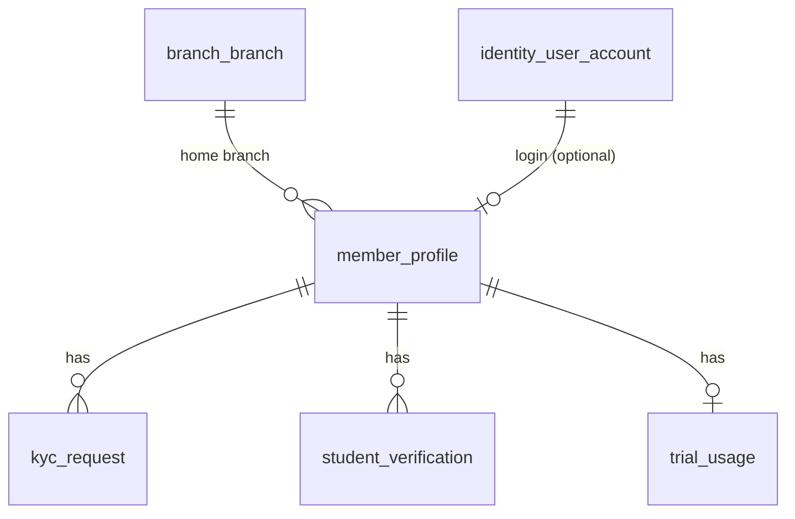

# P2 — Member, KYC, Student Verification, Trial Usage

Nguồn: `modules/member-kyc.md`, `business/business-rules.md` (BR-004…011), `status-flow.md`.
Quy ước chung: xem [`README.md`](README.md).

## Phạm vi
`member_profile`, `kyc_request`, `student_verification`, `trial_usage`.

## ERD

## `member_profile`
| Cột | Kiểu | Ràng buộc | Ghi chú |
|---|---|---|---|
| id | BIGINT | PK identity | |
| code | VARCHAR(30) | UNIQUE NOT NULL | `MBR-...` đối ngoại |
| user_account_id | BIGINT | FK identity_user_account, UNIQUE, NULL | member web login (Keycloak) |
| full_name | VARCHAR(150) | NOT NULL | |
| phone | VARCHAR(20) | partial UNIQUE WHERE NOT NULL | chặn trùng SĐT |
| email | VARCHAR(255) | partial UNIQUE WHERE NOT NULL | |
| gender | VARCHAR(10) | CHECK IN ('MALE','FEMALE','OTHER') | |
| date_of_birth | DATE | NULL | |
| home_branch_id | BIGINT | FK branch_branch | BR-004 |
| is_student | BOOLEAN | NOT NULL DEFAULT false | từ student_verification APPROVED |
| status | VARCHAR(20) | NOT NULL DEFAULT 'REGISTERED', CHECK IN ('LEAD','REGISTERED','KYC_PENDING','ACTIVE','INACTIVE','SUSPENDED','BLACKLISTED') | `status-flow` Member |
| created_at/updated_at | timestamptz | NOT NULL DEFAULT now() | trigger |

- Index: `(home_branch_id)`, `(status)`, `(phone)`.
- VIP không lưu ở đây — suy ra từ `membership` đang ACTIVE có `is_vip` (P3).

## `kyc_request`
| Cột | Kiểu | Ràng buộc | Ghi chú |
|---|---|---|---|
| id | BIGINT | PK identity | |
| member_id | BIGINT | FK member_profile | |
| identity_type | VARCHAR(20) | NOT NULL DEFAULT 'CCCD', CHECK IN ('CCCD') | |
| identity_number_masked | VARCHAR(20) | NOT NULL | hiển thị che (vd `0790****1234`) |
| identity_number_hash | VARCHAR(64) | NOT NULL | hash để so trùng (không lưu số thật) |
| front_image_url | VARCHAR(255) | NULL | **object key** S3 (ADR-0010) |
| back_image_url | VARCHAR(255) | NULL | object key S3 |
| status | VARCHAR(20) | NOT NULL DEFAULT 'PENDING', CHECK IN ('NOT_SUBMITTED','PENDING','APPROVED','REJECTED','REQUEST_RESUBMIT','EXPIRED') | |
| submitted_at | timestamptz | NULL | |
| reviewed_by | BIGINT | FK staff_staff, NULL | |
| reviewed_at | timestamptz | NULL | |
| rejection_reason | TEXT | NULL | |
| created_at/updated_at | timestamptz | NOT NULL DEFAULT now() | trigger |

- **Race/unique**: 1 CCCD chỉ duyệt cho 1 người → `CREATE UNIQUE INDEX ux_kyc_cccd_approved ON kyc_request(identity_number_hash) WHERE status='APPROVED';`
- Số CCCD đầy đủ KHÔNG lưu DB; chỉ lưu masked + hash. Xem full qua quyền `MEMBER_VIEW_FULL_CCCD`.

## `student_verification`
| Cột | Kiểu | Ràng buộc |
|---|---|---|
| id | BIGINT | PK identity |
| member_id | BIGINT | FK member_profile |
| school_name | VARCHAR(150) | NOT NULL |
| student_card_image_url | VARCHAR(255) | NULL (object key S3) |
| status | VARCHAR(20) | NOT NULL DEFAULT 'PENDING', CHECK IN ('PENDING','APPROVED','REJECTED','EXPIRED') |
| expired_at | timestamptz | NULL |
| reviewed_by | BIGINT | FK staff_staff, NULL |
| reviewed_at | timestamptz | NULL |
| created_at/updated_at | timestamptz | NOT NULL DEFAULT now() (trigger) |

## `trial_usage`
| Cột | Kiểu | Ràng buộc | Ghi chú |
|---|---|---|---|
| id | BIGINT | PK identity | |
| member_id | BIGINT | FK member_profile | |
| identity_number_hash | VARCHAR(64) | **UNIQUE** NOT NULL | **BR-007: 1 CCCD chỉ trial 1 lần** |
| trial_started_at | timestamptz | NULL | |
| trial_ended_at | timestamptz | NULL | +7 ngày (BR-005) |
| status | VARCHAR(20) | NOT NULL DEFAULT 'KYC_PENDING', CHECK IN ('KYC_PENDING','ACTIVE','EXPIRED','CONVERTED','CANCELLED') | `status-flow` Trial |
| created_at/updated_at | timestamptz | NOT NULL DEFAULT now() (trigger) | |

- **Race/unique**: `UNIQUE(identity_number_hash)` chặn cấp trial lần 2.
- Trial yêu cầu KYC APPROVED trước khi ACTIVE (BR-006) — kiểm ở application.
- Giới hạn 1 check-in/ngày của trial: thực thi ở P4 (`checkin_log`).

## Race-condition (P2)
- `UNIQUE(trial_usage.identity_number_hash)` — 1 trial/CCCD.
- Partial unique approved CCCD — không 2 người cùng 1 CCCD đã duyệt.
- Partial unique `phone`/`email`.

## Migration dự kiến
`V006__member.sql` · `V007__kyc.sql` (kyc_request, student_verification, trial_usage).
