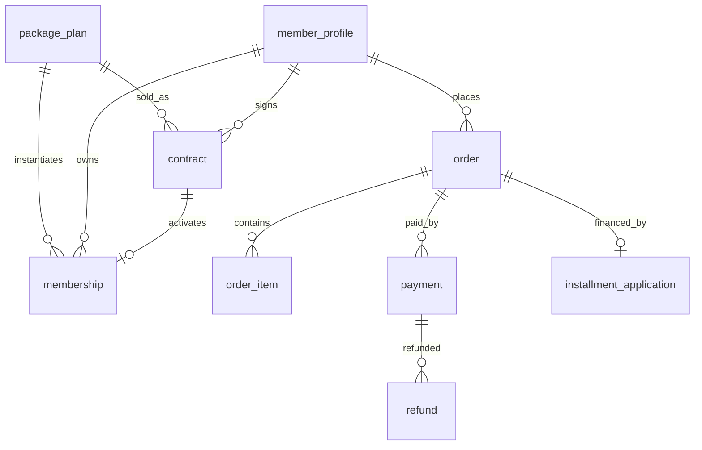

# P3 — Package, Membership, Contract, Order, Payment, Installment

Nguồn: `modules/package-contract-payment.md`, `business-rules.md` (BR-042…046, BR-001/002), `status-flow.md`.

## Phạm vi
`package_plan`, `membership`, `contract`, `order`, `order_item`, `payment`, `refund`, `installment_application`.

## ERD

## `package_plan` (catalog)
| Cột | Kiểu | Ràng buộc | Ghi chú |
|---|---|---|---|
| id | BIGINT | PK identity | |
| code | VARCHAR(40) | UNIQUE NOT NULL | |
| name | VARCHAR(150) | NOT NULL | |
| package_type | VARCHAR(30) | NOT NULL, CHECK IN ('TRIAL','MONTHLY','QUARTERLY','YEARLY','VIP','STUDENT','CLASS_PASS','PT_SESSION','MASSAGE_ADDON','PRIVATE_ROOM_EXTRA') | |
| duration_days | INT | NULL CHECK (>=0) | trial=7 |
| price | NUMERIC(14,2) | NOT NULL CHECK (>=0) | |
| currency | VARCHAR(3) | NOT NULL DEFAULT 'VND' | |
| is_vip | BOOLEAN | NOT NULL DEFAULT false | |
| is_student_only | BOOLEAN | NOT NULL DEFAULT false | |
| total_sessions | INT | NULL | class pass / PT pack |
| daily_checkin_limit | INT | NULL | trial=1; NULL=không giới hạn (BR-002) |
| private_room_minutes_per_month | INT | NULL | quota VIP (BR-013) |
| massage_free_per_week | INT | NULL | VIP=3 (BR-015) |
| installment_allowed | BOOLEAN | NOT NULL DEFAULT false | chỉ true cho QUARTERLY/YEARLY (BR-044) |
| is_active | BOOLEAN | NOT NULL DEFAULT true | |
| created_at/updated_at | timestamptz | NOT NULL DEFAULT now() (trigger) | |

## `membership` (instance đang hiệu lực — điều khiển quyền vào cửa)
| Cột | Kiểu | Ràng buộc | Ghi chú |
|---|---|---|---|
| id | BIGINT | PK identity | |
| code | VARCHAR(30) | UNIQUE NOT NULL | |
| member_id | BIGINT | FK member_profile | |
| package_plan_id | BIGINT | FK package_plan | |
| contract_id | BIGINT | FK contract, NULL | |
| sale_branch_id | BIGINT | FK branch_branch | BR-004 |
| status | VARCHAR(20) | NOT NULL DEFAULT 'PENDING_PAYMENT', CHECK IN ('PENDING_PAYMENT','ACTIVE','EXPIRED','SUSPENDED','CANCELLED') | |
| effective_from | timestamptz | NULL | |
| effective_to | timestamptz | NULL | |
| created_at/updated_at | timestamptz | NOT NULL DEFAULT now() (trigger) | |

- Index: `(member_id, status)`, `(effective_to)`. Check-in (P4) đọc membership ACTIVE còn hạn.

## `contract`
| Cột | Kiểu | Ràng buộc | Ghi chú |
|---|---|---|---|
| id | BIGINT | PK identity | |
| contract_code | VARCHAR(30) | UNIQUE NOT NULL | |
| member_id | BIGINT | FK member_profile | |
| package_plan_id | BIGINT | FK package_plan | |
| sale_branch_id | BIGINT | FK branch_branch | |
| status | VARCHAR(20) | NOT NULL DEFAULT 'DRAFT', CHECK IN ('DRAFT','PENDING_SIGNATURE','ACTIVE','EXPIRED','TERMINATED','CANCELLED','SUSPENDED') | không cần manager duyệt (BR-042) |
| signed_at | timestamptz | NULL | |
| effective_from | timestamptz | NULL | |
| effective_to | timestamptz | NULL | |
| total_amount | NUMERIC(14,2) | NOT NULL CHECK (>=0) | |
| currency | VARCHAR(3) | NOT NULL DEFAULT 'VND' | |
| document_url | VARCHAR(255) | NULL | contract PDF (S3) |
| created_at/updated_at | timestamptz | NOT NULL DEFAULT now() (trigger) | |

- ACTIVE sau khi ký + thanh toán hợp lệ (BR-043) — orchestrate ở application.

## `order` + `order_item`
**order**: id · order_code UNIQUE · member_id FK · branch_id FK · order_type CHECK IN ('PACKAGE','POS_PRODUCT','PANTRY','CLASS_PASS','PT_SESSION','MASSAGE','PRIVATE_ROOM','BOOKING_EXTRA') · contract_id FK NULL · status CHECK IN ('DRAFT','PENDING_PAYMENT','PAID','CANCELLED','REFUNDED','PARTIALLY_REFUNDED') · total_amount NUMERIC(14,2) · currency · coupon_id FK NULL (P8) · created_at/updated_at.

**order_item**: id · order_id FK · item_type CHECK IN ('PACKAGE','PRODUCT','PANTRY','SESSION') · ref_id BIGINT (plan/product) · description · quantity INT CHECK(>0) · unit_price NUMERIC(14,2) · line_amount NUMERIC(14,2) · created_at. (POS nhiều dòng — P7 dùng lại order/order_item, không tạo bảng sale_order riêng.)

## `payment`
| Cột | Kiểu | Ràng buộc | Ghi chú |
|---|---|---|---|
| id | BIGINT | PK identity | |
| payment_code | VARCHAR(30) | UNIQUE NOT NULL | |
| order_id | BIGINT | FK order | |
| payment_method | VARCHAR(20) | NOT NULL, CHECK IN ('ONLINE','COUNTER_CASH','COUNTER_CARD','INSTALLMENT') | |
| payment_status | VARCHAR(20) | NOT NULL DEFAULT 'PENDING_PAYMENT', CHECK IN ('UNPAID','PENDING_PAYMENT','PAID','FAILED','EXPIRED','REFUNDED','PARTIALLY_REFUNDED') | |
| provider | VARCHAR(40) | NULL | VNPAY/MOMO/... |
| provider_transaction_id | VARCHAR(100) | NULL | |
| idempotency_key | VARCHAR(100) | NULL | |
| amount | NUMERIC(14,2) | NOT NULL CHECK (>=0) | |
| currency | VARCHAR(3) | NOT NULL DEFAULT 'VND' | |
| paid_at | timestamptz | NULL | |
| created_at/updated_at | timestamptz | NOT NULL DEFAULT now() (trigger) | |

- **Race/idempotency (BR payment callback)**:
  - `CREATE UNIQUE INDEX ux_payment_provider_txn ON payment(provider, provider_transaction_id) WHERE provider_transaction_id IS NOT NULL;`
  - `CREATE UNIQUE INDEX ux_payment_idem ON payment(idempotency_key) WHERE idempotency_key IS NOT NULL;`

## `refund`
id · refund_code UNIQUE · payment_id FK · amount NUMERIC(14,2) CHECK(>=0) · reason TEXT · status CHECK IN ('PENDING','COMPLETED','FAILED') · refunded_at · created_at/updated_at.

## `installment_application`
| Cột | Kiểu | Ràng buộc | Ghi chú |
|---|---|---|---|
| id | BIGINT | PK identity | |
| application_code | VARCHAR(30) | UNIQUE NOT NULL | |
| order_id | BIGINT | FK order | |
| provider | VARCHAR(40) | NOT NULL | FE_CREDIT, HOME_CREDIT (BR-045) |
| status | VARCHAR(30) | NOT NULL DEFAULT 'DRAFT', CHECK IN ('DRAFT','SUBMITTED','PENDING_PROVIDER_APPROVAL','APPROVED','REJECTED','CANCELLED','DISBURSED') | |
| provider_application_code | VARCHAR(100) | NULL | |
| amount | NUMERIC(14,2) | NOT NULL CHECK (>=0) | |
| submitted_at / approved_at | timestamptz | NULL | |
| rejected_reason | TEXT | NULL | |
| created_at/updated_at | timestamptz | NOT NULL DEFAULT now() (trigger) | |

- BR-044: trả góp chỉ QUARTERLY/YEARLY → validate ở application (kiểm `package_plan.installment_allowed`).

## Race-condition (P3)
- Payment callback idempotent: unique `(provider, provider_transaction_id)` + `idempotency_key`.
- Kích hoạt contract/membership trong **1 transaction** sau khi payment PAID.

## Migration dự kiến
`V008__package_plan.sql` · `V009__contract_membership.sql` · `V010__order_payment.sql` · `V011__installment.sql`.
