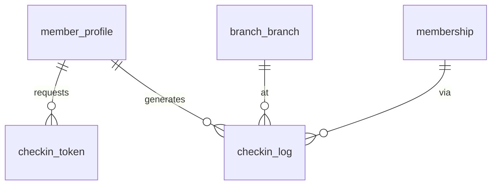

# P4 — QR Check-in

Nguồn: `modules/checkin.md`, `business-rules.md` (BR-002/003/008/009), ADR-0009 (Redis).

## Phạm vi
`checkin_token`, `checkin_log`. Redis lo phần ephemeral (token TTL, nonce, dup-scan lock); PostgreSQL là durable guard.

## ERD


## `checkin_token`
| Cột | Kiểu | Ràng buộc | Ghi chú |
|---|---|---|---|
| id | BIGINT | PK identity | |
| member_id | BIGINT | FK member_profile | |
| nonce | VARCHAR(64) | **UNIQUE** NOT NULL | one-time-use |
| expires_at | timestamptz | NOT NULL | TTL 30–60s (cũng giữ ở Redis) |
| used_at | timestamptz | NULL | |
| status | VARCHAR(20) | NOT NULL DEFAULT 'ACTIVE', CHECK IN ('ACTIVE','USED','EXPIRED') | |
| created_at | timestamptz | NOT NULL DEFAULT now() | |

- **Race (one-time use)**: tiêu thụ token bằng atomic update:
  ```sql
  UPDATE checkin_token SET status='USED', used_at=now()
  WHERE nonce=:nonce AND status='ACTIVE' AND expires_at > now();
  -- affected=1 -> hợp lệ; 0 -> QR_EXPIRED / QR_ALREADY_USED
  ```
- Redis: lưu nonce với TTL + cờ đã-dùng để chặn nhanh nhiều gate đọc song song (lớp đầu); DB `UNIQUE(nonce)` là chốt cuối.

## `checkin_log`
| Cột | Kiểu | Ràng buộc | Ghi chú |
|---|---|---|---|
| id | BIGINT | PK identity | |
| member_id | BIGINT | FK member_profile | |
| branch_id | BIGINT | FK branch_branch | check-in branch (BR-004) |
| membership_id | BIGINT | FK membership, NULL | gói dùng để vào |
| checkin_type | VARCHAR(20) | NOT NULL, CHECK IN ('TRIAL','PAID') | |
| checkin_time | timestamptz | NOT NULL DEFAULT now() | |
| checkin_date | DATE | NOT NULL | (= checkin_time theo giờ VN) phục vụ giới hạn ngày |
| result | VARCHAR(10) | NOT NULL, CHECK IN ('ALLOWED','DENIED') | |
| denied_reason | VARCHAR(30) | NULL, CHECK IN ('QR_EXPIRED','QR_ALREADY_USED','DUPLICATE_SCAN','MEMBER_BLOCKED','PACKAGE_EXPIRED','TRIAL_DAILY_LIMIT_REACHED','KYC_REQUIRED','BRANCH_UNAVAILABLE') | |
| device_id | VARCHAR(60) | NULL | |
| created_at | timestamptz | NOT NULL DEFAULT now() | |

- **Race (trial 1 lần/ngày — BR-008)**:
  `CREATE UNIQUE INDEX ux_trial_daily ON checkin_log(member_id, checkin_date) WHERE checkin_type='TRIAL' AND result='ALLOWED';`
  → lần check-in ALLOWED thứ 2 trong ngày của trial sẽ vi phạm unique ⇒ `TRIAL_DAILY_LIMIT_REACHED`.
- **Dup-scan ngắn hạn (BR-003)**: dùng **Redis** short lock theo `(member_id, branch_id)` cửa sổ 3–5 phút (kể cả gói unlimited). Redis là cổng nhanh; không cần ghi DB cho mỗi lần chặn.
- Gói tháng/quý/năm: unlimited → không áp unique ngày (chỉ TRIAL bị giới hạn).
- Index: `(member_id, checkin_date)`, `(branch_id, checkin_time)`.

## Phân tầng Redis vs PostgreSQL
| Mối nguy | Redis (nhanh, ephemeral) | PostgreSQL (durable, chốt cuối) |
|---|---|---|
| QR hết hạn / đã dùng | TTL + cờ used | `UNIQUE(nonce)` + atomic update |
| Quét trùng 3–5 phút | short lock theo member+branch | (không bắt buộc) |
| Trial 1 lần/ngày | (tuỳ chọn cache) | **partial unique** `ux_trial_daily` |

## Migration dự kiến
`V012__checkin.sql` (checkin_token, checkin_log).
