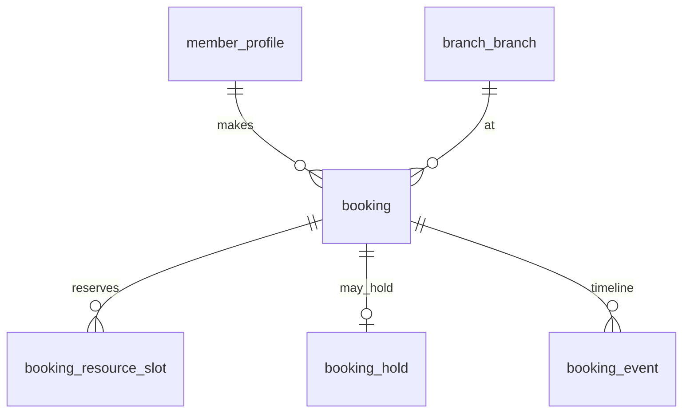

# P5 — Booking Core (Booking Engine)

Nguồn: `modules/booking-engine.md`, `business-rules.md` (BR-017…024), `status-flow.md`, `database-guideline.md` (`booking_resource_slot`).

## Phạm vi
`booking`, `booking_resource_slot`, `booking_hold`, `booking_event`. Là nền tảng dùng chung cho PT / group class / private room / massage (P6).

## Ý tưởng chống trùng giờ (cốt lõi)
Mỗi booking giữ một hoặc nhiều **tài nguyên theo khoảng thời gian** → tách ra bảng `booking_resource_slot` và dùng **EXCLUDE USING gist** (cần `btree_gist`, đã bật ở `V001`) để cấm 2 slot cùng resource chồng giờ. Một booking massage giữ **2 resource** (phòng + nhân viên) → 2 dòng slot. Class giữ chỗ theo **sức chứa** (không theo interval) nên xử lý ở `class_session` (P6).

## ERD

## `booking`
| Cột | Kiểu | Ràng buộc | Ghi chú |
|---|---|---|---|
| id | BIGINT | PK identity | |
| booking_code | VARCHAR(30) | UNIQUE NOT NULL | |
| booking_type | VARCHAR(20) | NOT NULL, CHECK IN ('PT','GROUP_CLASS','PRIVATE_ROOM','MASSAGE') | |
| member_id | BIGINT | FK member_profile | |
| branch_id | BIGINT | FK branch_branch | |
| start_time | timestamptz | NOT NULL | |
| end_time | timestamptz | NOT NULL, CHECK (end_time > start_time) | |
| status | VARCHAR(30) | NOT NULL DEFAULT 'DRAFT', CHECK IN ('DRAFT','PENDING_PAYMENT','CONFIRMED','WAITING_CUSTOMER_CONFIRMATION','CHECKED_IN','IN_PROGRESS','COMPLETED','CANCELLED','NO_SHOW','EXPIRED','REFUNDED') | `status-flow` Booking |
| payment_status | VARCHAR(20) | NULL, CHECK IN ('UNPAID','PENDING_PAYMENT','PAID','REFUNDED') | |
| used_quota_type | VARCHAR(20) | NULL, CHECK IN ('PRIVATE_ROOM_MINUTES','MASSAGE_FREE','CLASS_SESSION','PT_SESSION') | |
| used_quota_amount | NUMERIC(10,2) | NULL | hoàn lại khi huỷ hợp lệ |
| cancellation_reason | TEXT | NULL | |
| cancelled_by | VARCHAR(20) | NULL, CHECK IN ('MEMBER','GYM','SYSTEM') | BR-020/024 |
| no_show_at | timestamptz | NULL | |
| version | BIGINT | NOT NULL DEFAULT 0 | optimistic lock |
| created_at/updated_at | timestamptz | NOT NULL DEFAULT now() (trigger) | |

- **Member tự trùng giờ (BR-018)**:
  `ALTER TABLE booking ADD CONSTRAINT ex_member_overlap EXCLUDE USING gist (member_id WITH =, tstzrange(start_time,end_time) WITH &&) WHERE (status IN ('CONFIRMED','WAITING_CUSTOMER_CONFIRMATION','CHECKED_IN','IN_PROGRESS'));`
- Index: `(member_id, start_time)`, `(branch_id, start_time)`, `(status)`, `(booking_type)`.

## `booking_resource_slot` (chống trùng tài nguyên — BR-017)
| Cột | Kiểu | Ràng buộc | Ghi chú |
|---|---|---|---|
| id | BIGINT | PK identity | |
| booking_id | BIGINT | FK booking ON DELETE CASCADE | |
| resource_type | VARCHAR(20) | NOT NULL, CHECK IN ('TRAINER','PRIVATE_ROOM','MASSAGE_ROOM','MASSAGE_STAFF') | |
| resource_id | BIGINT | NOT NULL | id trainer/room/staff |
| start_time | timestamptz | NOT NULL | |
| end_time | timestamptz | NOT NULL, CHECK (end_time > start_time) | |

- **EXCLUDE (chốt cứng double-book)**:
  `ALTER TABLE booking_resource_slot ADD CONSTRAINT ex_resource_overlap EXCLUDE USING gist (resource_type WITH =, resource_id WITH =, tstzrange(start_time,end_time) WITH &&);`
- Khi booking bị `CANCELLED/EXPIRED/NO_SHOW` ⇒ **xoá slot** để giải phóng tài nguyên (booking quá khứ COMPLETED không cần giữ slot vì khoảng giờ đã qua).
- Class room/instructor **không** dùng bảng này — đã giữ chỗ ở `class_session` (P6).

## `booking_hold` (giữ chỗ chờ thanh toán)
id · booking_id FK UNIQUE · expires_at timestamptz NOT NULL · status CHECK IN ('HELD','RELEASED','CONSUMED') · created_at.
- Booking trả phí tạo `PENDING_PAYMENT` + hold; job hết hạn → `EXPIRED`, xoá slot (BR booking-engine "expire unpaid hold").
- Booking miễn phí/quota → vào thẳng `CONFIRMED` (status-flow note).

## `booking_event` (timeline)
id · booking_id FK · event_type VARCHAR(40) (CREATED, PAID, CONFIRMED, CHECKED_IN, STARTED, COMPLETED, CANCELLED, NO_SHOW, HOLD_30M, REFUNDED) · actor_type CHECK IN ('MEMBER','STAFF','SYSTEM') · actor_id BIGINT NULL · note TEXT · created_at.

## Quy tắc nghiệp vụ gắn schema
- **Huỷ ≥10h (BR-019)**: kiểm `now() <= start_time - interval '10 hours'` → hoàn quota/session/payment (cộng trả lại bảng quota/pass tương ứng) trong 1 transaction.
- **Trong 10h (BR-020)**: không hoàn trừ khi `cancelled_by='GYM'` (BR-024).
- **Giữ 30 phút (BR-021/022)**: `CONFIRMED → WAITING_CUSTOMER_CONFIRMATION`; quá 30' không đến → `NO_SHOW` (`no_show_at`), không hoàn (BR-023).

## Migration dự kiến
`V013__booking_core.sql` (booking, booking_resource_slot, booking_hold, booking_event + EXCLUDE).
