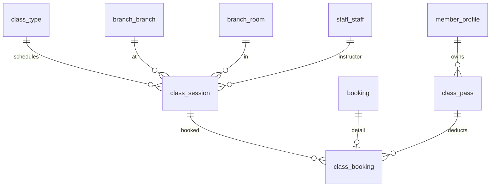

# P6 — Booking Verticals: Group Class, PT, Private Room, Massage

Nguồn: `modules/group-class.md`, `pt-booking.md`, `private-room.md`, `massage.md`, `business-rules.md` (BR-012…041).
Dựa trên P5 (`booking`, `booking_resource_slot`). Mỗi vertical có bảng *detail* nối `booking_id` + bảng tài nguyên/quota riêng.

---

## A. Group Class

### `class_type`
id · code UNIQUE · name · description · created_at/updated_at.

### `class_session`
| Cột | Kiểu | Ràng buộc |
|---|---|---|
| id | BIGINT | PK identity |
| class_type_id | BIGINT | FK class_type |
| branch_id | BIGINT | FK branch_branch |
| room_id | BIGINT | FK branch_room |
| instructor_id | BIGINT | FK staff_staff |
| start_time / end_time | timestamptz | NOT NULL, CHECK(end>start) |
| capacity | INT | NOT NULL CHECK (>0) |
| booked_count | INT | NOT NULL DEFAULT 0, CHECK (booked_count>=0 AND booked_count<=capacity) |
| status | VARCHAR(20) | NOT NULL DEFAULT 'SCHEDULED', CHECK IN ('SCHEDULED','OPEN_FOR_BOOKING','FULL','ONGOING','COMPLETED','CANCELLED') |
| created_at/updated_at | timestamptz | trigger |

- **Trùng phòng/HLV (BR-029)** — EXCLUDE trên chính lịch lớp:
  - `EXCLUDE USING gist (room_id WITH =, tstzrange(start_time,end_time) WITH &&) WHERE (status <> 'CANCELLED')`
  - `EXCLUDE USING gist (instructor_id WITH =, tstzrange(start_time,end_time) WITH &&) WHERE (status <> 'CANCELLED')`
- **Đầy lớp (BR-028)** — atomic:
  `UPDATE class_session SET booked_count=booked_count+1 WHERE id=:id AND booked_count<capacity;` (0 dòng ⇒ FULL).

### `class_pass`
id · code UNIQUE · member_id FK · class_type_scope BIGINT NULL (NULL=mọi lớp) · total_sessions INT CHECK(>0) · remaining_sessions INT CHECK(remaining_sessions>=0) · valid_from/valid_to · status CHECK IN ('ACTIVE','EXPIRED','USED_UP','CANCELLED') · source_order_id FK NULL · created_at/updated_at.
- **Trừ buổi atomic (BR-026)**: `UPDATE class_pass SET remaining_sessions=remaining_sessions-1 WHERE id=:id AND remaining_sessions>0;`

### `class_booking` (detail)
id · booking_id FK UNIQUE · class_session_id FK · member_id FK · class_pass_id FK NULL (NULL = quyền trial BR-010) · attendance_status CHECK IN ('BOOKED','ATTENDED','NO_SHOW','CANCELLED') · created_at.
- **1 member/1 session**: `UNIQUE(class_session_id, member_id)`.
- Huỷ hợp lệ ⇒ `booked_count-1` + hoàn `remaining_sessions+1` (1 transaction). No-show ⇒ mất buổi (BR-024 ngược lại).

---

## B. PT (1-1, 90 phút, 06:00–22:00)

### `trainer_profile`
id · staff_id FK UNIQUE · branch_id FK · level VARCHAR · specialties TEXT · price_per_session NUMERIC(14,2) · currency · status CHECK IN ('ACTIVE','INACTIVE') · created_at/updated_at.

### `trainer_availability`
id · trainer_id FK · branch_id FK · day_of_week SMALLINT CHECK (0..6) · start_time TIME · end_time TIME · CHECK (start_time>='06:00' AND end_time<='22:00' AND end_time>start_time). (BR-032/033)

### `pt_booking` (detail)
id · booking_id FK UNIQUE · trainer_id FK · duration_minutes INT NOT NULL DEFAULT 90 · price NUMERIC(14,2) · currency · completed_by_trainer_at timestamptz NULL · created_at.
- **Trùng giờ PT (BR-023 pt-doc)**: 1 slot `('TRAINER', trainer_id, start, end)` trong `booking_resource_slot` ⇒ EXCLUDE chặn double-book.
- Khung 06:00–22:00 + 90' validate ở application (so với `trainer_availability`).

### `pt_rating`
id · booking_id FK UNIQUE · member_id FK · trainer_id FK · rating SMALLINT CHECK (1..5) · comment TEXT · author_visible_to_trainer BOOLEAN NOT NULL DEFAULT false · created_at.
- **BR-035**: PT không thấy tác giả (`author_visible_to_trainer=false`); manager xem qua quyền `RATING_VIEW_AUTHOR`.

---

## C. Private Room (đặt theo giờ, ≤2h, quota tháng VIP)

### `private_room`
id · code UNIQUE · branch_id FK · room_id BIGINT FK branch_room NULL · name · capacity INT · hourly_price NUMERIC(14,2) · status CHECK IN ('AVAILABLE','BOOKED','IN_USE','CLEANING','MAINTENANCE','CLOSED') · created_at/updated_at. (status-flow Private Room)

### `private_room_quota` (quota tháng VIP — BR-013)
| Cột | Kiểu | Ràng buộc |
|---|---|---|
| id | BIGINT | PK identity |
| member_id | BIGINT | FK member_profile |
| year_month | DATE | NOT NULL (ngày 01 của tháng) |
| total_minutes | INT | NOT NULL CHECK (>=0) |
| used_minutes | INT | NOT NULL DEFAULT 0, CHECK (used_minutes>=0 AND used_minutes<=total_minutes) |
| created_at/updated_at | timestamptz | trigger |
- `UNIQUE(member_id, year_month)`.
- **Trừ quota atomic (BR-013)**: `UPDATE private_room_quota SET used_minutes=used_minutes+:d WHERE member_id=:m AND year_month=:ym AND used_minutes+:d<=total_minutes;`

### `private_room_booking` (detail)
id · booking_id FK UNIQUE · private_room_id FK · duration_minutes INT NOT NULL CHECK (duration_minutes>0 AND **duration_minutes<=120**) · quota_used_minutes INT DEFAULT 0 · paid_extra_amount NUMERIC(14,2) DEFAULT 0 · created_at.
- **≤2h (BR-014)** = CHECK 120'. Double-book phòng: slot `('PRIVATE_ROOM', private_room_id, start, end)` ⇒ EXCLUDE.
- Đủ quota ⇒ CONFIRMED + trừ quota; thiếu quota & cho phép ⇒ PENDING_PAYMENT trả thêm (BR-021 private-doc).

---

## D. Massage (VIP 3 free/tuần, phòng + nhân viên)

### `massage_service`
id · code UNIQUE · name · internal_duration_minutes INT · price NUMERIC(14,2) · currency · active BOOLEAN. (BR-040 cấu hình nội bộ)

### `massage_room`
id · branch_id FK · room_id FK branch_room NULL · name · status CHECK IN ('AVAILABLE','CLEANING','MAINTENANCE','CLOSED') · created_at/updated_at.

### `massage_staff_availability`
id · staff_id FK · branch_id FK · day_of_week SMALLINT CHECK(0..6) · start_time TIME · end_time TIME CHECK(end>start).

### `massage_weekly_usage` (quota tuần — BR-015)
| Cột | Kiểu | Ràng buộc |
|---|---|---|
| id | BIGINT | PK identity |
| member_id | BIGINT | FK member_profile |
| week_start_date | DATE | NOT NULL (Thứ 2 đầu tuần) |
| free_used_count | INT | NOT NULL DEFAULT 0, CHECK (free_used_count>=0) |
| created_at/updated_at | timestamptz | trigger |
- `UNIQUE(member_id, week_start_date)`.
- **Trừ free atomic (BR-016, limit=3 cấu hình)**: `UPDATE massage_weekly_usage SET free_used_count=free_used_count+1 WHERE member_id=:m AND week_start_date=:w AND free_used_count<:limit;` (0 dòng ⇒ phải trả phí).

### `massage_booking` (detail — 2 tài nguyên)
id · booking_id FK UNIQUE · massage_service_id FK · massage_room_id FK · massage_staff_id FK · free_quota_used BOOLEAN DEFAULT false · paid_amount NUMERIC(14,2) DEFAULT 0 · created_at.
- **Trùng phòng & nhân viên (BR-041)**: tạo **2 dòng** `booking_resource_slot`: `('MASSAGE_ROOM', room_id, ...)` và `('MASSAGE_STAFF', staff_id, ...)` ⇒ EXCLUDE chặn cả hai chiều.

---

## Tổng hợp race-condition P6
| Cơ chế | Bảng | Bảo vệ |
|---|---|---|
| EXCLUDE gist | booking_resource_slot | trùng giờ trainer/private_room/massage room+staff |
| EXCLUDE gist | class_session | trùng giờ phòng/HLV của lịch lớp |
| atomic `booked_count<capacity` | class_session | đầy lớp |
| atomic `remaining_sessions>0` | class_pass | trừ buổi 2 lần |
| atomic `used_minutes+d<=total` | private_room_quota | vượt quota VIP |
| atomic `free_used_count<limit` | massage_weekly_usage | vượt 3 free/tuần |
| UNIQUE(session, member) | class_booking | đặt trùng lớp |

## Migration dự kiến
`V014__group_class.sql` · `V015__pt.sql` · `V016__private_room.sql` · `V017__massage.sql`.
