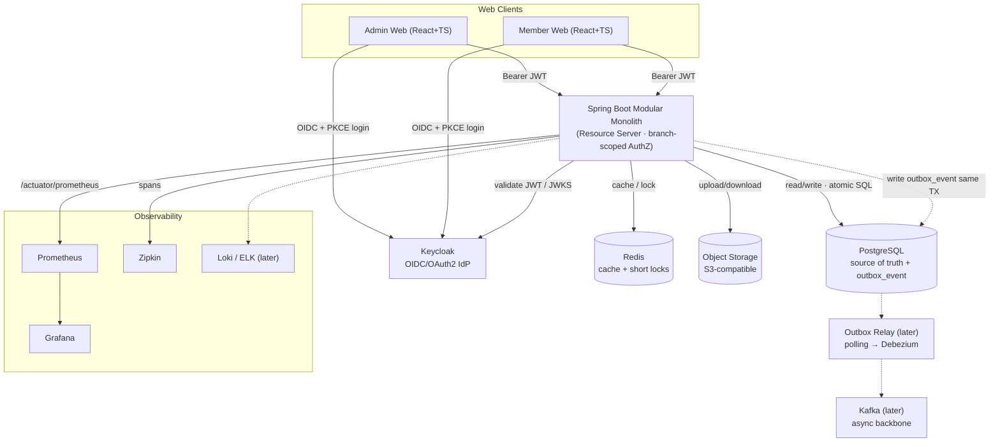

# Solution Architecture — Kiến trúc giải pháp (EN/VI)

> Bilingual document. Each section: **EN** first, **VI** below.
> Tài liệu song ngữ. Mỗi mục: **EN** trước, **VI** bên dưới.
>
> Canonical diagram / Sơ đồ chuẩn: [`diagrams/solution_architecture.svg`](diagrams/solution_architecture.svg)
> Status: PROPOSED — aligned to the owner's architecture diagram. / Trạng thái: ĐỀ XUẤT — đã khớp sơ đồ của owner.

## 1. Purpose / Mục đích

**EN —** Target technical architecture of the gym-platform. It stays a **Spring Boot Modular Monolith** (one deployable backend). Supporting infrastructure: **Keycloak** (authentication/OIDC), **PostgreSQL** (source of truth), **Redis** (cache + short-lived locks), **Object Storage** (S3-compatible, documents/images), a **Transactional Outbox** (now), and **Kafka** as an async backbone (**later**). Observability via **Prometheus + Grafana** and **Zipkin** (+ Loki/ELK for logs later). None of these are microservices.

**VI —** Kiến trúc kỹ thuật mục tiêu của gym-platform. Vẫn là **Spring Boot Modular Monolith** (một backend triển khai). Hạ tầng hỗ trợ: **Keycloak** (xác thực/OIDC), **PostgreSQL** (nguồn sự thật), **Redis** (cache + lock ngắn hạn), **Object Storage** (tương thích S3, tài liệu/ảnh), **Transactional Outbox** (dùng ngay), và **Kafka** làm xương sống bất đồng bộ (**triển khai sau**). Quan sát qua **Prometheus + Grafana** và **Zipkin** (+ Loki/ELK cho log sau này). Không có cái nào là microservices.

## 2. Architecture principles / Nguyên tắc kiến trúc

**EN —**
- Modular Monolith first: one deployable Spring Boot app, modules under `com.gym.*`.
- Core flows (payment, contract, booking, check-in, quota, stock) keep **strong consistency** via **PostgreSQL transactions + atomic SQL / constraints**.
- **Authentication** is delegated to Keycloak. **Branch-scoped authorization stays inside the internal `identity` module** (role · branch scope · ownership · fine-grained permission).
- **Redis** handles ephemeral, performance-critical concerns (QR token TTL, one-time nonce, duplicate-scan lock, rate limiting). **Durable uniqueness stays in PostgreSQL** (e.g. 1 trial/CCCD, payment txn id).
- **Object Storage** holds binary documents; the DB stores only the **object key/URL**.
- Async side-effects are captured **now** via a **Transactional Outbox**; **Kafka** delivery is added **later** without breaking the seam.

**VI —**
- Modular Monolith trước: một app Spring Boot, module dưới `com.gym.*`.
- Luồng lõi (thanh toán, hợp đồng, booking, check-in, quota, kho) giữ **nhất quán mạnh** bằng **transaction PostgreSQL + atomic SQL / constraint**.
- **Xác thực** giao cho Keycloak. **Phân quyền theo chi nhánh nằm trong module `identity` nội bộ** (role · phạm vi chi nhánh · quyền sở hữu · quyền hạt mịn).
- **Redis** lo phần ephemeral, nhạy hiệu năng (QR token TTL, nonce một lần, lock chống quét trùng, rate limit). **Uniqueness bền vững vẫn ở PostgreSQL** (vd 1 trial/CCCD, payment txn id).
- **Object Storage** chứa tài liệu nhị phân; DB chỉ lưu **object key/URL**.
- Tác vụ phụ async được **ghi nhận ngay** qua **Transactional Outbox**; phần phát đi bằng **Kafka** thêm vào **sau** mà không phá vỡ điểm nối.

## 3. High-level context / Bối cảnh tổng thể

## 4. Logical components / Thành phần luận lý

| Component | Responsibility (EN) | Trách nhiệm (VI) | Now/Later |
|---|---|---|---|
| Admin/Member Web | React+TS SPA, OIDC login (PKCE) | SPA React+TS, đăng nhập OIDC (PKCE) | now |
| Keycloak | AuthN, tokens, MFA, sessions | Xác thực, token, MFA, phiên | now |
| API Monolith | Business modules, resource server, branch-scoped authZ | Module nghiệp vụ, resource server, phân quyền theo chi nhánh | now |
| PostgreSQL | Source of truth + `outbox_event` | Nguồn sự thật + `outbox_event` | now |
| Redis | Cache + short locks (QR TTL, nonce, dup-scan, rate limit) | Cache + lock ngắn (QR TTL, nonce, chống quét trùng, rate limit) | now |
| Object Storage (S3) | CCCD/student images, contract PDF, invoices, media | Ảnh CCCD/thẻ SV, contract PDF, hóa đơn, media | now |
| Transactional Outbox | Capture domain events in the business TX | Ghi domain event trong cùng TX nghiệp vụ | now |
| Outbox Relay + Kafka | Publish + async backbone (notification, audit, report, CRM) | Phát đi + xương sống async | **later** |
| Prometheus / Grafana | Metrics + dashboards/alerts | Metrics + dashboard/cảnh báo | now |
| Zipkin | Distributed tracing | Tracing phân tán | now |
| Loki / ELK | Centralized logs | Log tập trung | **later** |

## 5. Authentication & Authorization / Xác thực & Phân quyền

**EN —** **Keycloak = authentication; the app = authorization (confirmed by the architecture diagram).**
- Realm `gym-platform`; clients `gym-admin-web`, `gym-member-web` (public + PKCE); API = OAuth2 **resource server** validating JWT via JWKS.
- The app maps JWT `sub` → internal principal, then the **`identity` module** enforces: **Role · Branch scope · Ownership · Fine-grained permission** using `rbac_*` + `staff_branch_assignment`.
- No passwords in the app DB; `identity_user_account` maps internal id ↔ `keycloak_user_id`. (See `data-model/p1-identity-org.md`.)

**VI —** **Keycloak = xác thực; app = phân quyền (đã được sơ đồ kiến trúc xác nhận).**
- Realm `gym-platform`; client `gym-admin-web`, `gym-member-web` (public + PKCE); API = **resource server** OAuth2 kiểm tra JWT qua JWKS.
- App ánh xạ `sub` trong JWT → principal nội bộ, rồi **module `identity`** thực thi: **Role · Phạm vi chi nhánh · Quyền sở hữu · Quyền hạt mịn** dựa trên `rbac_*` + `staff_branch_assignment`.
- App DB không lưu mật khẩu; `identity_user_account` ánh xạ id nội bộ ↔ `keycloak_user_id`. (Xem `data-model/p1-identity-org.md`.)

## 6. Data stores & runtime support / Kho dữ liệu & hỗ trợ runtime

**EN —**
- **PostgreSQL** — source of truth: business tables, constraints & indexes, ACID transactions, atomic SQL. Holds `outbox_event`.
- **Redis** — cache & short-lived locks: **QR token TTL**, **one-time nonce**, **duplicate-scan lock**, **rate limiting**. Redis is a *performance/ephemeral* layer; it does **not** replace durable DB constraints. Authoritative race protection (trial-once-per-CCCD, payment idempotency, class booking uniqueness, stock/quota) stays in PostgreSQL (see `CLAUDE.md` Race Condition Protection).
- **Object Storage (S3-compatible)** — CCCD / student card images, contract PDF, invoice/receipt, equipment/product images. The DB stores only the object key/URL; sensitive objects are access-controlled by RBAC and reads/writes audited.

**VI —**
- **PostgreSQL** — nguồn sự thật: bảng nghiệp vụ, constraint & index, transaction ACID, atomic SQL. Chứa `outbox_event`.
- **Redis** — cache & lock ngắn hạn: **QR token TTL**, **nonce một lần**, **lock chống quét trùng**, **rate limit**. Redis là lớp *hiệu năng/ephemeral*; **không** thay thế constraint bền vững của DB. Bảo vệ race condition có thẩm quyền (trial 1 lần/CCCD, idempotency thanh toán, uniqueness đặt lớp, kho/quota) vẫn ở PostgreSQL (xem `CLAUDE.md`).
- **Object Storage (S3)** — ảnh CCCD/thẻ SV, contract PDF, hóa đơn/biên nhận, ảnh thiết bị/sản phẩm. DB chỉ lưu object key/URL; object nhạy cảm kiểm soát truy cập bằng RBAC và audit khi đọc/ghi.

## 7. Async eventing / Sự kiện bất đồng bộ — Outbox now, Kafka later

**EN —**
- **Now**: business modules append events to **`outbox_event`** within the **same DB transaction** as the business change → "event recorded iff business change committed". Nothing is lost even before Kafka exists.
- **Later**: an **Outbox Relay** (polling first, **Debezium CDC** later) publishes committed events to **Kafka**, where async consumers react (notification, audit, report, CRM). Consumers must be **idempotent**.
- Core consistency-critical decisions are **never** moved to Kafka — they stay transactional in PostgreSQL. Kafka only carries resulting facts.

**VI —**
- **Bây giờ**: module nghiệp vụ ghi event vào **`outbox_event`** trong **cùng transaction DB** với thay đổi nghiệp vụ → "event được ghi khi và chỉ khi thay đổi đã commit". Không mất event ngay cả khi chưa có Kafka.
- **Sau này**: **Outbox Relay** (polling trước, **Debezium CDC** sau) publish event đã commit lên **Kafka** để consumer async xử lý (notification, audit, report, CRM). Consumer phải **idempotent**.
- Quyết định lõi cần nhất quán **không bao giờ** đưa sang Kafka — vẫn transactional trong PostgreSQL. Kafka chỉ chở sự kiện kết quả.

## 8. Observability / Quan sát

**EN —** Metrics: Micrometer/Actuator `/actuator/prometheus` → **Prometheus** → **Grafana** (JVM, HTTP, DB pool, business KPIs; Kafka lag later). Tracing: Micrometer Tracing (Brave/OTel) → **Zipkin**, context propagated over HTTP (and Kafka later). Logs: structured with `traceId`/`spanId`; centralized **Loki/ELK later**.

**VI —** Metrics: Micrometer/Actuator `/actuator/prometheus` → **Prometheus** → **Grafana** (JVM, HTTP, DB pool, KPI nghiệp vụ; Kafka lag sau). Tracing: Micrometer Tracing (Brave/OTel) → **Zipkin**, lan truyền context qua HTTP (và Kafka sau). Log: có cấu trúc kèm `traceId`/`spanId`; tập trung **Loki/ELK sau**.

## 9. Local development topology / Hạ tầng dev local

**EN —** `infra/docker/docker-compose.yml` provides: `postgres`, `pgadmin`, `keycloak`, `redis`, `minio` (S3) + `minio-setup`, `prometheus`, `grafana`, `zipkin`. **Kafka is deferred** (commented block in the compose). The Spring app runs on the host (port 8080); Keycloak is mapped to 8085 to avoid clashing.

**VI —** `infra/docker/docker-compose.yml` cung cấp: `postgres`, `pgadmin`, `keycloak`, `redis`, `minio` (S3) + `minio-setup`, `prometheus`, `grafana`, `zipkin`. **Kafka hoãn lại** (khối comment trong compose). App Spring chạy trên host (cổng 8080); Keycloak map sang 8085 để tránh đụng cổng.

## 10. Decisions status / Trạng thái quyết định

| # | Decision | Status |
|---|---|---|
| 1 | Hybrid: Keycloak authN + app branch-scoped authZ | ✅ Confirmed by diagram |
| 2 | Async: Transactional Outbox now, Kafka later (polling → Debezium) | ✅ Per diagram |
| 3 | Redis for cache + short locks (durable uniqueness stays in PostgreSQL) | ✅ Per diagram → ADR-0009 |
| 4 | Object Storage (S3) for documents/images; DB stores object key only | ✅ Per diagram → ADR-0010 |
| 5 | CLAUDE.md baseline updated with adopted supporting infra | ✅ Updated |

ADRs: **0006** Keycloak · **0007** Outbox-now/Kafka-later · **0008** Observability · **0009** Redis · **0010** Object Storage.
