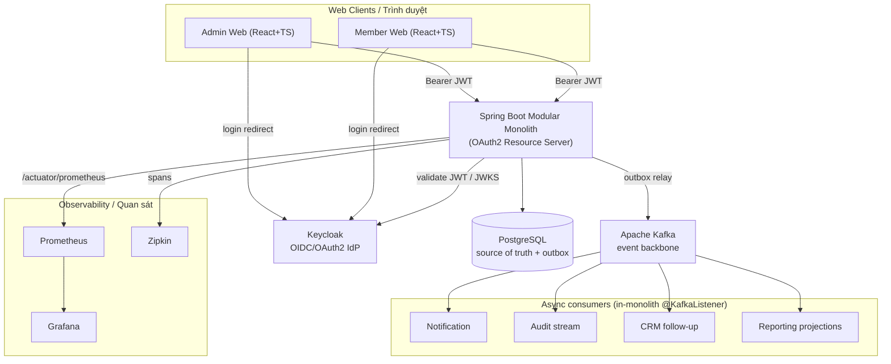
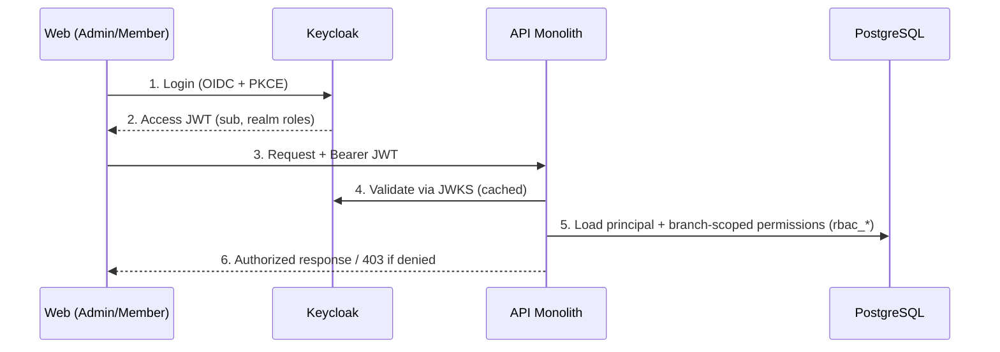
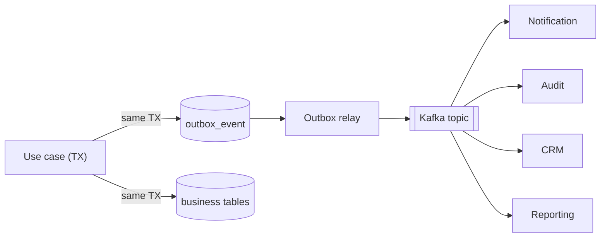

# Solution Architecture — Kiến trúc giải pháp (EN/VI)

> Bilingual document. Each section: **EN** first, **VI** below.
> Tài liệu song ngữ. Mỗi mục: **EN** trước, **VI** bên dưới.
>
> Status: PROPOSED — pending owner approval. / Trạng thái: ĐỀ XUẤT — chờ owner duyệt.

## 1. Purpose / Mục đích

**EN —** This document describes the target technical architecture of the gym-platform after adopting four infrastructure decisions: **Keycloak** (authentication / identity provider), **Apache Kafka** (asynchronous event backbone), **Prometheus + Grafana** (metrics & dashboards), and **Zipkin** (distributed tracing). The system stays a **Modular Monolith**; these are *supporting infrastructure*, not a move to microservices.

**VI —** Tài liệu mô tả kiến trúc kỹ thuật mục tiêu của gym-platform sau khi áp dụng 4 quyết định hạ tầng: **Keycloak** (xác thực / nhà cung cấp định danh), **Apache Kafka** (xương sống sự kiện bất đồng bộ), **Prometheus + Grafana** (chỉ số & dashboard), và **Zipkin** (tracing phân tán). Hệ thống **vẫn là Modular Monolith**; đây là *hạ tầng hỗ trợ*, không phải chuyển sang microservices.

## 2. Architecture principles / Nguyên tắc kiến trúc

**EN —**
- Modular Monolith first: one deployable Spring Boot app, modules under `com.gym.*` (see `modular-monolith.md`).
- Strong consistency for core flows (payment, contract, booking, check-in, quota, stock) stays **in-process + PostgreSQL transactions + atomic SQL / constraints**. Kafka is NOT in the race-condition critical path.
- Async side-effects (notification, audit stream, CRM follow-up, reporting projections) are decoupled via Kafka using the **Transactional Outbox** pattern.
- Authentication is delegated to Keycloak (OIDC/OAuth2). Fine-grained, **branch-scoped authorization stays in the app**.
- Everything observable: metrics (Prometheus), traces (Zipkin), correlated logs.

**VI —**
- Modular Monolith trước: một app Spring Boot triển khai duy nhất, module dưới `com.gym.*` (xem `modular-monolith.md`).
- Nhất quán mạnh cho luồng lõi (thanh toán, hợp đồng, booking, check-in, quota, kho) vẫn xử lý **in-process + transaction PostgreSQL + atomic SQL / constraint**. Kafka **không** nằm trong đường găng chống race condition.
- Tác vụ phụ bất đồng bộ (notification, luồng audit, CSKH follow-up, projection báo cáo) được tách rời qua Kafka theo mẫu **Transactional Outbox**.
- Xác thực giao cho Keycloak (OIDC/OAuth2). Phân quyền hạt mịn **theo chi nhánh vẫn nằm trong app**.
- Mọi thứ quan sát được: metrics (Prometheus), trace (Zipkin), log có tương quan.

## 3. High-level context / Bối cảnh tổng thể

**EN —** Browsers authenticate against Keycloak and call the API with a Bearer JWT. The API validates the token via Keycloak's JWKS, executes business logic against PostgreSQL, and writes integration events to an outbox table; a relay publishes them to Kafka where async consumers react. Metrics are scraped by Prometheus and visualized in Grafana; traces are exported to Zipkin.

**VI —** Trình duyệt xác thực với Keycloak rồi gọi API kèm Bearer JWT. API kiểm tra token qua JWKS của Keycloak, chạy nghiệp vụ trên PostgreSQL, và ghi sự kiện tích hợp vào bảng outbox; một relay publish chúng lên Kafka để các consumer bất đồng bộ xử lý. Prometheus thu thập metrics và Grafana hiển thị; trace được xuất sang Zipkin.

## 4. Logical components / Thành phần luận lý

| Component / Thành phần | Responsibility (EN) | Trách nhiệm (VI) |
|---|---|---|
| Admin/Member Web | React+TS SPA, OIDC login via Keycloak (PKCE) | SPA React+TS, đăng nhập OIDC qua Keycloak (PKCE) |
| Keycloak | AuthN, token issuance, password policy, MFA, sessions | Xác thực, cấp token, chính sách mật khẩu, MFA, phiên |
| API Monolith | Business modules `com.gym.*`, OAuth2 resource server, branch-scoped authZ | Module nghiệp vụ `com.gym.*`, resource server OAuth2, phân quyền theo chi nhánh |
| PostgreSQL | Source of truth + transactional outbox | Nguồn sự thật + outbox giao dịch |
| Kafka | Async event transport, decoupling, future extraction | Vận chuyển sự kiện async, giảm phụ thuộc, sẵn cho tách service |
| Prometheus | Scrape & store metrics from `/actuator/prometheus` | Thu thập & lưu metrics từ `/actuator/prometheus` |
| Grafana | Dashboards, alerts on metrics | Dashboard, cảnh báo trên metrics |
| Zipkin | Collect & query distributed traces | Thu thập & tra cứu trace phân tán |

## 5. Authentication & Authorization / Xác thực & Phân quyền

**EN —** **Keycloak owns authentication; the app owns branch-scoped authorization (hybrid).**
- Keycloak realm `gym-platform`. Clients: `gym-admin-web`, `gym-member-web` (public + PKCE), and the API as an OAuth2 **resource server** validating JWT (`issuer-uri`, JWKS).
- Keycloak carries coarse identity + high-level realm roles (e.g. `STAFF`, `MEMBER`). It does **not** model "Branch Manager at branch X only" — realm roles cannot express per-branch scope cleanly.
- The app maps the JWT `sub` (stable Keycloak user id) to an internal principal, then loads **fine-grained, branch-scoped permissions** from the `rbac_*` + `staff_branch_assignment` tables. Authorization decisions (e.g. `MEMBER_VIEW_FULL_CCCD`, `RATING_VIEW_AUTHOR`, branch access) are enforced in the application layer.
- The app DB no longer stores passwords. `identity_user_account` becomes a thin mapping: internal id ↔ `keycloak_user_id` (UUID) + `account_type` (STAFF/MEMBER) + mirrored status. (See §9 impact on P1.)

**VI —** **Keycloak lo xác thực; app lo phân quyền theo chi nhánh (hybrid).**
- Realm Keycloak `gym-platform`. Client: `gym-admin-web`, `gym-member-web` (public + PKCE), và API là **resource server** OAuth2 kiểm tra JWT (`issuer-uri`, JWKS).
- Keycloak mang định danh thô + realm role cấp cao (vd `STAFF`, `MEMBER`). Nó **không** mô hình hóa "Branch Manager chỉ ở chi nhánh X" — realm role không biểu diễn gọn scope theo chi nhánh.
- App ánh xạ `sub` trong JWT (id người dùng Keycloak ổn định) sang principal nội bộ, rồi nạp **quyền hạt mịn theo chi nhánh** từ bảng `rbac_*` + `staff_branch_assignment`. Quyết định phân quyền (vd `MEMBER_VIEW_FULL_CCCD`, `RATING_VIEW_AUTHOR`, quyền truy cập chi nhánh) được thực thi ở tầng application.
- App DB **không** lưu mật khẩu nữa. `identity_user_account` trở thành bảng ánh xạ mỏng: id nội bộ ↔ `keycloak_user_id` (UUID) + `account_type` (STAFF/MEMBER) + status đồng bộ. (Xem §9 tác động P1.)

## 6. Eventing with Kafka / Sự kiện với Kafka

**EN —** Kafka decouples async side-effects without weakening core consistency.
- **Transactional Outbox**: in the same DB transaction as the business change, the module appends a row to an `outbox_event` table. A relay (Debezium-style CDC later, or a polling publisher initially) publishes committed rows to Kafka and marks them sent. This guarantees "event published iff business change committed" — consistent with our race-condition rules.
- **In-process stays in-process**: payment confirmation, booking slot acquisition, quota/stock deduction use PostgreSQL constraints / atomic SQL / transactions — *not* Kafka. Kafka only carries the resulting **facts**.
- **Topics** (by aggregate, keyed by aggregate id for ordering): `member.events`, `kyc.events`, `contract.events`, `payment.events`, `booking.events`, `checkin.events`, `inventory.events`, `audit.events`.
- **Consumers** (initially `@KafkaListener` inside the monolith; extractable later): Notification, Audit stream, CRM follow-up, Reporting projections. Consumers must be **idempotent** (dedupe by event id).

**VI —** Kafka tách rời tác vụ phụ async mà không làm yếu nhất quán lõi.
- **Transactional Outbox**: trong cùng transaction DB với thay đổi nghiệp vụ, module ghi 1 dòng vào bảng `outbox_event`. Một relay (sau này dạng CDC Debezium, ban đầu là publisher polling) publish các dòng đã commit lên Kafka và đánh dấu đã gửi. Đảm bảo "event được publish khi và chỉ khi thay đổi nghiệp vụ đã commit" — đúng với rule chống race condition.
- **In-process vẫn in-process**: xác nhận thanh toán, giành slot booking, trừ quota/kho dùng constraint PostgreSQL / atomic SQL / transaction — *không* qua Kafka. Kafka chỉ chở **sự kiện kết quả**.
- **Topic** (theo aggregate, key theo id aggregate để giữ thứ tự): `member.events`, `kyc.events`, `contract.events`, `payment.events`, `booking.events`, `checkin.events`, `inventory.events`, `audit.events`.
- **Consumer** (ban đầu `@KafkaListener` trong monolith; sau tách được): Notification, Audit stream, CSKH follow-up, Projection báo cáo. Consumer phải **idempotent** (khử trùng theo event id).

## 7. Observability / Quan sát

**EN —**
- **Metrics**: Spring Boot Actuator + Micrometer expose `/actuator/prometheus`; Prometheus scrapes; Grafana dashboards (JVM, HTTP, DB pool, Kafka lag, business KPIs).
- **Tracing**: Micrometer Tracing (OpenTelemetry/Brave bridge) exports spans to **Zipkin**. Trace context propagates across HTTP **and** Kafka (producer/consumer headers) for end-to-end traces.
- **Logging**: structured logs enriched with `traceId`/`spanId` for correlation with Zipkin.
- **Health**: `/actuator/health` reports `db`, `flyway`, `kafka`, and Keycloak readiness.

**VI —**
- **Metrics**: Spring Boot Actuator + Micrometer expose `/actuator/prometheus`; Prometheus scrape; Grafana dashboard (JVM, HTTP, DB pool, Kafka lag, KPI nghiệp vụ).
- **Tracing**: Micrometer Tracing (cầu nối OpenTelemetry/Brave) xuất span sang **Zipkin**. Trace context lan truyền qua HTTP **và** Kafka (header producer/consumer) để có trace đầu-cuối.
- **Logging**: log có cấu trúc kèm `traceId`/`spanId` để tương quan với Zipkin.
- **Health**: `/actuator/health` báo `db`, `flyway`, `kafka`, và readiness Keycloak.

## 8. Local development topology / Hạ tầng dev local

**EN —** `infra/docker/docker-compose.yml` will add (next step, on approval): `keycloak` (+ its own Postgres schema/db), `kafka` (KRaft mode, no ZooKeeper), `prometheus`, `grafana`, `zipkin`, and optionally `kafka-ui`. App config (`application.yaml`) gains: OAuth2 resource-server issuer-uri, Kafka bootstrap servers, Prometheus endpoint exposure, Zipkin endpoint.

**VI —** `infra/docker/docker-compose.yml` sẽ thêm (bước sau, khi được duyệt): `keycloak` (+ Postgres/db riêng), `kafka` (chế độ KRaft, không ZooKeeper), `prometheus`, `grafana`, `zipkin`, và tùy chọn `kafka-ui`. Cấu hình app (`application.yaml`) bổ sung: issuer-uri resource-server OAuth2, Kafka bootstrap servers, expose endpoint Prometheus, endpoint Zipkin.

## 9. Impact on existing design / Tác động lên thiết kế hiện có

**EN —**
1. **P1 data model (identity/rbac)** must be revised: drop `password_hash`; `identity_user_account` becomes a Keycloak mapping (`keycloak_user_id` UUID UNIQUE, `account_type`). `rbac_*` and `staff_branch_assignment` **remain** as app-side authorization. See `data-model/p1-identity-org.md` (to be updated).
2. **New tables**: `outbox_event` (+ consumer idempotency/dedupe table) — designed in a dedicated phase.
3. **Maven deps (later)**: `spring-boot-starter-oauth2-resource-server`, `spring-kafka`, `micrometer-registry-prometheus`, `micrometer-tracing-bridge-brave` + `zipkin-reporter-brave`.
4. **Docs to update**: `architecture-overview.md` (move these from "future" to "current"), `CLAUDE.md` locked baseline (add approved infra) — proposed, see §10.
5. ADRs created: **ADR-0006** (Keycloak), **ADR-0007** (Kafka), **ADR-0008** (Observability).

**VI —**
1. **Data model P1 (identity/rbac)** phải sửa: bỏ `password_hash`; `identity_user_account` thành bảng ánh xạ Keycloak (`keycloak_user_id` UUID UNIQUE, `account_type`). `rbac_*` và `staff_branch_assignment` **giữ nguyên** làm phân quyền phía app. Xem `data-model/p1-identity-org.md` (sẽ cập nhật).
2. **Bảng mới**: `outbox_event` (+ bảng khử trùng idempotency cho consumer) — thiết kế ở một phase riêng.
3. **Maven deps (sau)**: `spring-boot-starter-oauth2-resource-server`, `spring-kafka`, `micrometer-registry-prometheus`, `micrometer-tracing-bridge-brave` + `zipkin-reporter-brave`.
4. **Docs cần cập nhật**: `architecture-overview.md` (chuyển các hạ tầng này từ "tương lai" sang "hiện tại"), locked baseline `CLAUDE.md` (thêm hạ tầng đã duyệt) — đề xuất, xem §10.
5. ADR đã tạo: **ADR-0006** (Keycloak), **ADR-0007** (Kafka), **ADR-0008** (Observability).

## 10. Decisions to confirm / Quyết định cần chốt

**EN —**
1. **Authorization model**: confirm hybrid (Keycloak authN + app branch-scoped authZ). Alternative: push all roles into Keycloak (loses clean per-branch scoping).
2. **CLAUDE.md baseline edit**: may I add Keycloak/Kafka/Prometheus+Grafana/Zipkin to the "Locked Technical Baseline" as approved supporting infrastructure (still Modular Monolith)?
3. **Outbox relay**: start with a simple polling publisher now, move to Debezium CDC later — OK?

**VI —**
1. **Mô hình phân quyền**: xác nhận hybrid (Keycloak xác thực + app phân quyền theo chi nhánh). Phương án khác: đẩy toàn bộ role vào Keycloak (mất khả năng scope theo chi nhánh gọn gàng).
2. **Sửa baseline CLAUDE.md**: cho phép tôi thêm Keycloak/Kafka/Prometheus+Grafana/Zipkin vào "Locked Technical Baseline" như hạ tầng hỗ trợ đã duyệt (vẫn Modular Monolith) chứ?
3. **Outbox relay**: bắt đầu bằng publisher polling đơn giản, sau chuyển Debezium CDC — được không?
