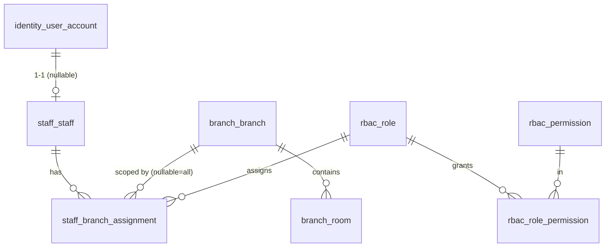

# P1 — Identity, RBAC, Branch, Staff

> English version. Vietnamese (canonical): [`../../../vi/architecture/data-model/p1-identity-org.md`](../../../vi/architecture/data-model/p1-identity-org.md).

Organizational foundation: login accounts, roles/permissions, branches + rooms, staff + per-branch assignment.
Sources: `modules/staff-rbac.md`, `business/domain-map.md`, `business/business-rules.md` (BR-004), `status-flow.md`.

## Scope
- `identity_user_account` — login account (used by staff; reused by members in P2).
- `rbac_role`, `rbac_permission`, `rbac_role_permission` — roles & permissions.
- `branch_branch`, `branch_room` — branches & rooms (physical rooms reused for booking in P5/P6).
- `staff_staff`, `staff_branch_assignment` — staff & per-branch role assignment.

## ERD

## `identity_user_account`
> ⚠️ **REVISED by ADR-0006 (Keycloak).** Authentication moved to Keycloak — the app DB no longer stores passwords. This table is a thin mapping between an internal principal and the Keycloak user. See [`../solution-architecture.md`](../solution-architecture.md) §5.

| Column | Type | Constraint | Note |
|---|---|---|---|
| id | BIGINT | PK, identity | stable internal principal, used for FKs |
| keycloak_user_id | UUID | UNIQUE, NOT NULL | the `sub` in the Keycloak JWT |
| account_type | VARCHAR(20) | NOT NULL, CHECK IN ('STAFF','MEMBER') | principal type |
| username | VARCHAR(100) | UNIQUE, NULL | convenience copy (source of truth in Keycloak) |
| email | VARCHAR(255) | partial UNIQUE when NOT NULL | convenience copy |
| status | VARCHAR(20) | NOT NULL DEFAULT 'ACTIVE', CHECK IN ('ACTIVE','DISABLED','LOCKED') | mirrors Keycloak status |
| last_login_at | timestamptz | NULL | |
| created_at / updated_at | timestamptz | NOT NULL DEFAULT now() | trigger |

- **No `password_hash`** (Keycloak manages credentials).
- Indexes: `UNIQUE(keycloak_user_id)`; `UNIQUE(username) WHERE username IS NOT NULL`; partial `UNIQUE(email) WHERE email IS NOT NULL`.
- `rbac_*` + `staff_branch_assignment` below **stay** — this is app-side branch-scoped authorization (Keycloak does not replace it).

## `rbac_role`
Roles. Seed the 15 roles from `staff-rbac.md`.

| Column | Type | Constraint | Note |
|---|---|---|---|
| id | BIGINT | PK, identity | |
| code | VARCHAR(50) | UNIQUE, NOT NULL | `SUPER_ADMIN`, `OPERATION_MANAGER`, `BRANCH_MANAGER`, `RECEPTIONIST`, `SALES`, `CUSTOMER_CARE`, `PERSONAL_TRAINER`, `CLASS_INSTRUCTOR`, `MASSAGE_STAFF`, `CLEANER`, `PARKING_STAFF`, `MAINTENANCE_STAFF`, `ACCOUNTANT`, `MARKETING_STAFF`, `PARTNER_MANAGER` |
| name | VARCHAR(100) | NOT NULL | |
| description | TEXT | NULL | |
| scope | VARCHAR(20) | NOT NULL DEFAULT 'BRANCH', CHECK IN ('GLOBAL','BRANCH') | `GLOBAL` = system-wide (Super Admin, Operation Manager) |
| is_system | BOOLEAN | NOT NULL DEFAULT false | system role, deletion blocked |
| created_at / updated_at | timestamptz | NOT NULL DEFAULT now() | trigger |

## `rbac_permission`
Fine-grained permissions. Seeded incrementally per module (P1 seeds the basics).

| Column | Type | Constraint | Note |
|---|---|---|---|
| id | BIGINT | PK, identity | |
| code | VARCHAR(80) | UNIQUE, NOT NULL | e.g. `MEMBER_CREATE`, `MEMBER_VIEW_FULL_CCCD`, `KYC_APPROVE`, `PACKAGE_SELL`, `POS_SELL`, `CHECKIN_SUPPORT`, `BOOKING_MANAGE`, `RATING_VIEW_AUTHOR`, `MAINTENANCE_MANAGE` |
| module | VARCHAR(50) | NULL | grouping: `member`, `kyc`, `booking`... |
| description | TEXT | NULL | |
| created_at / updated_at | timestamptz | NOT NULL DEFAULT now() | trigger |

> `RATING_VIEW_AUTHOR` implements: **PT cannot see the rating author, the manager can** (staff-rbac.md).
> `MEMBER_VIEW_FULL_CCCD` implements: **CCCD is not exposed in full to roles without the permission** (member-kyc.md).

## `rbac_role_permission`
Role ↔ permission join (N-N).

| Column | Type | Constraint |
|---|---|---|
| role_id | BIGINT | FK → rbac_role(id) ON DELETE CASCADE |
| permission_id | BIGINT | FK → rbac_permission(id) ON DELETE CASCADE |
| | | PK(role_id, permission_id) |

- Index: `(permission_id)` for reverse lookups.

## `branch_branch`
Branches. Serves BR-004 (home/sale/check-in branch are tracked separately — other modules reference this branch).

| Column | Type | Constraint | Note |
|---|---|---|---|
| id | BIGINT | PK, identity | |
| code | VARCHAR(30) | UNIQUE, NOT NULL | |
| name | VARCHAR(150) | NOT NULL | |
| address / district | VARCHAR | NULL | |
| city | VARCHAR(100) | NOT NULL DEFAULT 'Ho Chi Minh City' | |
| phone | VARCHAR(20) | NULL | |
| open_24h | BOOLEAN | NOT NULL DEFAULT true | gym is 24/7; PT/pantry have their own windows |
| status | VARCHAR(20) | NOT NULL DEFAULT 'ACTIVE', CHECK IN ('ACTIVE','INACTIVE','CLOSED') | |
| created_at / updated_at | timestamptz | NOT NULL DEFAULT now() | trigger |

## `branch_room`
Physical room/area within a branch. P5/P6 (private room, class, massage) reference it as a resource.

| Column | Type | Constraint | Note |
|---|---|---|---|
| id | BIGINT | PK, identity | |
| branch_id | BIGINT | FK → branch_branch(id) | intra-module FK |
| code | VARCHAR(30) | NOT NULL | |
| name | VARCHAR(100) | NULL | |
| room_type | VARCHAR(30) | NOT NULL, CHECK IN ('GENERAL','CLASS_ROOM','PT_AREA','PRIVATE_ROOM','MASSAGE_ROOM') | |
| capacity | INT | NULL, CHECK (capacity IS NULL OR capacity >= 0) | for class rooms |
| status | VARCHAR(20) | NOT NULL DEFAULT 'AVAILABLE', CHECK IN ('AVAILABLE','CLEANING','MAINTENANCE','CLOSED') | **physical** status; `BOOKED`/`IN_USE` belong to booking (P5/P6) |
| created_at / updated_at | timestamptz | NOT NULL DEFAULT now() | trigger |

- `UNIQUE(branch_id, code)`; index `(branch_id)`.

## `staff_staff`
Staff profile.

| Column | Type | Constraint | Note |
|---|---|---|---|
| id | BIGINT | PK, identity | |
| user_account_id | BIGINT | UNIQUE, NULL — **logical ref → identity** | linked when staff gets a login |
| employee_code | VARCHAR(30) | UNIQUE, NOT NULL | |
| full_name | VARCHAR(150) | NOT NULL | |
| phone / email | VARCHAR | NULL | |
| status | VARCHAR(20) | NOT NULL DEFAULT 'ACTIVE', CHECK IN ('ACTIVE','INACTIVE','TERMINATED') | |
| created_at / updated_at | timestamptz | NOT NULL DEFAULT now() | trigger |

## `staff_branch_assignment`
Assigns roles to staff per branch. The source of branch-scoped RBAC enforcement.

| Column | Type | Constraint | Note |
|---|---|---|---|
| id | BIGINT | PK, identity | |
| staff_id | BIGINT | FK → staff_staff(id) ON DELETE CASCADE | intra-module FK |
| branch_id | BIGINT | NULL — **logical ref → branch** | **NULL = all branches** (for `scope=GLOBAL` roles) |
| role_id | BIGINT | NOT NULL — **logical ref → identity.rbac_role** | |
| active | BOOLEAN | NOT NULL DEFAULT true | |
| assigned_at | timestamptz | NOT NULL DEFAULT now() | |
| created_at / updated_at | timestamptz | NOT NULL DEFAULT now() | trigger |

- Uniqueness (note NULL): `CREATE UNIQUE INDEX ux_staff_assignment ON staff_branch_assignment (staff_id, COALESCE(branch_id, 0), role_id);`
- Index: `(branch_id)`, `(role_id)`.

## Seed data (P1)
- **Roles**: insert the 15 roles (`is_system=true`; `SUPER_ADMIN`/`OPERATION_MANAGER` → `scope=GLOBAL`, others `BRANCH`).
- **Permissions**: seed the basic groups (member/kyc/checkin/pos/booking/rating/maintenance) — extended per phase later.
- **Bootstrap Super Admin**: account + staff + `SUPER_ADMIN` assignment (branch NULL). **Password is not hardcoded in the migration** — provided via env / a separate init script.

## Edge cases / open decisions
1. A staff member can hold multiple roles across multiple branches → supported (multiple assignment rows).
2. A `GLOBAL` role is assigned with `branch_id=NULL`; the application layer must validate: a `scope=BRANCH` role requires a NOT NULL `branch_id`.
3. Member accounts (P2) reuse `identity_user_account`; if staff/member accounts must be distinguished, consider an `account_type` column (already present).
4. `branch_room` covers all three booking room types; specific config (private-room monthly quota, class capacity...) lives in dedicated P6 tables referencing `branch_room.id`.

## Planned migrations
- `V002__identity_rbac.sql` — `identity_user_account`, `rbac_role`, `rbac_permission`, `rbac_role_permission`.
- `V003__branch.sql` — `branch_branch`, `branch_room`.
- `V004__staff.sql` — `staff_staff`, `staff_branch_assignment`.
- `V005__seed_rbac.sql` — seed roles + basic permissions.
