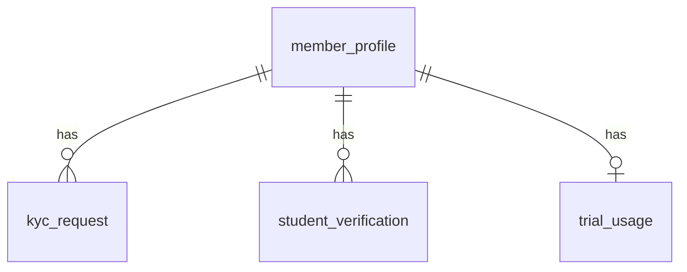

# P2 — Member, KYC, Student Verification, Trial Usage

> English version. Vietnamese (canonical): [`../../../vi/architecture/data-model/p2-member-kyc.md`](../../../vi/architecture/data-model/p2-member-kyc.md).

Sources: `modules/member-kyc.md`, `business/business-rules.md` (BR-004…011), `status-flow.md`.
Common conventions: see [`README.md`](README.md).

## Scope
`member_profile`, `kyc_request`, `student_verification`, `trial_usage`.

## ERD

## `member_profile`
| Column | Type | Constraint | Note |
|---|---|---|---|
| id | BIGINT | PK identity | |
| code | VARCHAR(30) | UNIQUE NOT NULL | `MBR-...` external |
| user_account_id | BIGINT | UNIQUE, NULL — logical ref → identity | member web login (Keycloak) |
| full_name | VARCHAR(150) | NOT NULL | |
| phone | VARCHAR(20) | partial UNIQUE WHERE NOT NULL | block duplicate phone |
| email | VARCHAR(255) | partial UNIQUE WHERE NOT NULL | |
| gender | VARCHAR(10) | CHECK IN ('MALE','FEMALE','OTHER') | |
| date_of_birth | DATE | NULL | |
| home_branch_id | BIGINT | NOT NULL — logical ref → branch | BR-004 |
| is_student | BOOLEAN | NOT NULL DEFAULT false | from APPROVED student_verification |
| status | VARCHAR(20) | NOT NULL DEFAULT 'REGISTERED', CHECK IN ('LEAD','REGISTERED','KYC_PENDING','ACTIVE','INACTIVE','SUSPENDED','BLACKLISTED') | `status-flow` Member |
| created_at / updated_at | timestamptz | NOT NULL DEFAULT now() | trigger |

- Indexes: `(home_branch_id)`, `(status)`, `(phone)`.
- VIP is not stored here — derived from an ACTIVE `membership` with `is_vip` (P3).

## `kyc_request`
| Column | Type | Constraint | Note |
|---|---|---|---|
| id | BIGINT | PK identity | |
| member_id | BIGINT | NOT NULL — logical ref → member | |
| identity_type | VARCHAR(20) | NOT NULL DEFAULT 'CCCD', CHECK IN ('CCCD') | |
| identity_number_masked | VARCHAR(20) | NOT NULL | masked display (e.g. `0790****1234`) |
| identity_number_hash | VARCHAR(64) | NOT NULL | hash for matching (real number not stored) |
| front_image_url / back_image_url | VARCHAR(255) | NULL | **object key** in S3 (ADR-0010) |
| status | VARCHAR(20) | NOT NULL DEFAULT 'PENDING', CHECK IN ('NOT_SUBMITTED','PENDING','APPROVED','REJECTED','REQUEST_RESUBMIT','EXPIRED') | |
| submitted_at | timestamptz | NULL | |
| reviewed_by | BIGINT | NULL — logical ref → staff | |
| reviewed_at | timestamptz | NULL | |
| rejection_reason | TEXT | NULL | |
| created_at / updated_at | timestamptz | NOT NULL DEFAULT now() | trigger |

- **Race/unique**: one CCCD can be approved for only one person → `CREATE UNIQUE INDEX ux_kyc_cccd_approved ON kyc_request(identity_number_hash) WHERE status='APPROVED';`
- The full CCCD number is NOT stored in the DB; only masked + hash. View full via the `MEMBER_VIEW_FULL_CCCD` permission.

## `student_verification`
| Column | Type | Constraint |
|---|---|---|
| id | BIGINT | PK identity |
| member_id | BIGINT | NOT NULL — logical ref → member |
| school_name | VARCHAR(150) | NOT NULL |
| student_card_image_url | VARCHAR(255) | NULL (S3 object key) |
| status | VARCHAR(20) | NOT NULL DEFAULT 'PENDING', CHECK IN ('PENDING','APPROVED','REJECTED','EXPIRED') |
| expired_at | timestamptz | NULL |
| reviewed_by | BIGINT | NULL — logical ref → staff |
| reviewed_at | timestamptz | NULL |
| created_at / updated_at | timestamptz | NOT NULL DEFAULT now() (trigger) |

## `trial_usage`
| Column | Type | Constraint | Note |
|---|---|---|---|
| id | BIGINT | PK identity | |
| member_id | BIGINT | NOT NULL — logical ref → member | |
| identity_number_hash | VARCHAR(64) | **UNIQUE** NOT NULL | **BR-007: 1 trial per CCCD** |
| trial_started_at | timestamptz | NULL | |
| trial_ended_at | timestamptz | NULL | +7 days (BR-005) |
| status | VARCHAR(20) | NOT NULL DEFAULT 'KYC_PENDING', CHECK IN ('KYC_PENDING','ACTIVE','EXPIRED','CONVERTED','CANCELLED') | `status-flow` Trial |
| created_at / updated_at | timestamptz | NOT NULL DEFAULT now() (trigger) | |

- **Race/unique**: `UNIQUE(identity_number_hash)` blocks issuing a second trial.
- Trial requires APPROVED KYC before becoming ACTIVE (BR-006) — checked in the application.
- Trial's 1-check-in-per-day limit is enforced in P4 (`checkin_log`).

## Race conditions (P2)
- `UNIQUE(trial_usage.identity_number_hash)` — 1 trial per CCCD.
- Partial unique approved CCCD — no two people with the same approved CCCD.
- Partial unique `phone`/`email`.

## Planned migrations
`V006__member.sql` · `V007__kyc.sql` (kyc_request, student_verification, trial_usage).
