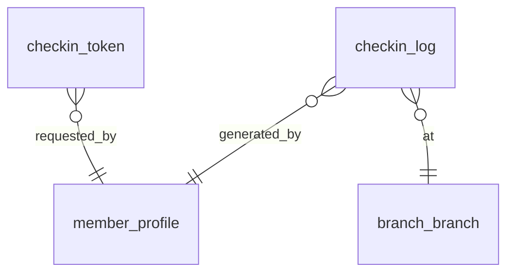

# P4 — QR Check-in

> English version. Vietnamese (canonical): [`../../../vi/architecture/data-model/p4-checkin.md`](../../../vi/architecture/data-model/p4-checkin.md).

Sources: `modules/checkin.md`, `business-rules.md` (BR-002/003/008/009), ADR-0009 (Redis).

## Scope
`checkin_token`, `checkin_log`. Redis handles the ephemeral part (token TTL, nonce, dup-scan lock); PostgreSQL is the durable guard.

## ERD


## `checkin_token`
| Column | Type | Constraint | Note |
|---|---|---|---|
| id | BIGINT | PK identity | |
| member_id | BIGINT | NOT NULL — logical ref → member | |
| nonce | VARCHAR(64) | **UNIQUE** NOT NULL | one-time-use |
| expires_at | timestamptz | NOT NULL | TTL 30–60s (also kept in Redis) |
| used_at | timestamptz | NULL | |
| status | VARCHAR(20) | NOT NULL DEFAULT 'ACTIVE', CHECK IN ('ACTIVE','USED','EXPIRED') | |
| created_at | timestamptz | NOT NULL DEFAULT now() | |

- **Race (one-time use)**: consume the token with an atomic update:
  ```sql
  UPDATE checkin_token SET status='USED', used_at=now()
  WHERE nonce=:nonce AND status='ACTIVE' AND expires_at > now();
  -- affected=1 -> valid; 0 -> QR_EXPIRED / QR_ALREADY_USED
  ```
- Redis: store the nonce with a TTL + used flag to quickly block multiple gates reading in parallel (first gate); the DB `UNIQUE(nonce)` is the final guard.

## `checkin_log`
| Column | Type | Constraint | Note |
|---|---|---|---|
| id | BIGINT | PK identity | |
| member_id | BIGINT | NOT NULL — logical ref → member | |
| branch_id | BIGINT | NOT NULL — logical ref → branch | check-in branch (BR-004) |
| membership_id | BIGINT | NULL — logical ref → membership | the package used to enter |
| checkin_type | VARCHAR(20) | NOT NULL, CHECK IN ('TRIAL','PAID') | |
| checkin_time | timestamptz | NOT NULL DEFAULT now() | |
| checkin_date | DATE | NOT NULL | (= checkin_time in VN time) for the daily limit |
| result | VARCHAR(10) | NOT NULL, CHECK IN ('ALLOWED','DENIED') | |
| denied_reason | VARCHAR(30) | NULL, CHECK IN ('QR_EXPIRED','QR_ALREADY_USED','DUPLICATE_SCAN','MEMBER_BLOCKED','PACKAGE_EXPIRED','TRIAL_DAILY_LIMIT_REACHED','KYC_REQUIRED','BRANCH_UNAVAILABLE') | |
| device_id | VARCHAR(60) | NULL | |
| created_at | timestamptz | NOT NULL DEFAULT now() | |

- **Race (trial 1/day — BR-008)**:
  `CREATE UNIQUE INDEX ux_trial_daily ON checkin_log(member_id, checkin_date) WHERE checkin_type='TRIAL' AND result='ALLOWED';`
  → the 2nd ALLOWED trial check-in in a day violates the unique index ⇒ `TRIAL_DAILY_LIMIT_REACHED`.
- **Short dup-scan (BR-003)**: use a **Redis** short lock per `(member_id, branch_id)` for a 3–5 minute window (even for unlimited packages). Redis is the fast gate; no DB write needed for each block.
- Monthly/quarterly/yearly: unlimited → no daily unique (only TRIAL is limited).
- Indexes: `(member_id, checkin_date)`, `(branch_id, checkin_time)`.

## Redis vs PostgreSQL split
| Risk | Redis (fast, ephemeral) | PostgreSQL (durable, final guard) |
|---|---|---|
| QR expired / used | TTL + used flag | `UNIQUE(nonce)` + atomic update |
| Dup-scan 3–5 min | short lock per member+branch | (optional) |
| Trial 1/day | (optional cache) | **partial unique** `ux_trial_daily` |

## Planned migrations
`V012__checkin.sql` (checkin_token, checkin_log).
