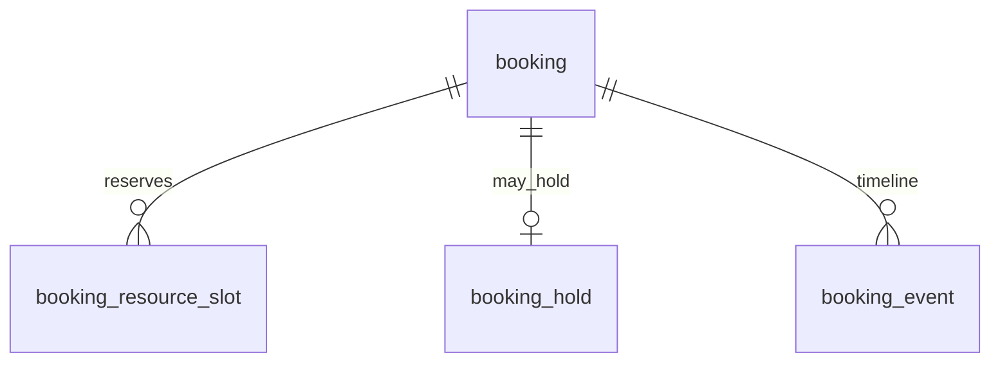

# P5 — Booking Core (Booking Engine)

> English version. Vietnamese (canonical): [`../../../vi/architecture/data-model/p5-booking-core.md`](../../../vi/architecture/data-model/p5-booking-core.md).

Sources: `modules/booking-engine.md`, `business-rules.md` (BR-017…024), `status-flow.md`, `database-guideline.md` (`booking_resource_slot`).

## Scope
`booking`, `booking_resource_slot`, `booking_hold`, `booking_event`. The shared foundation for PT / group class / private room / massage (P6).

## Overlap-prevention idea (core)
Each booking holds one or more **time-ranged resources** → split them into `booking_resource_slot` and use **EXCLUDE USING gist** (needs `btree_gist`, enabled in `V001`) to forbid two slots of the same resource overlapping in time. A massage booking holds **2 resources** (room + staff) → 2 slot rows. A class reserves capacity (not an interval), so it is handled on `class_session` (P6).

## ERD

## `booking`
| Column | Type | Constraint | Note |
|---|---|---|---|
| id | BIGINT | PK identity | |
| booking_code | VARCHAR(30) | UNIQUE NOT NULL | |
| booking_type | VARCHAR(20) | NOT NULL, CHECK IN ('PT','GROUP_CLASS','PRIVATE_ROOM','MASSAGE') | |
| member_id | BIGINT | NOT NULL — logical ref → member | |
| branch_id | BIGINT | NOT NULL — logical ref → branch | |
| start_time | timestamptz | NOT NULL | |
| end_time | timestamptz | NOT NULL, CHECK (end_time > start_time) | |
| status | VARCHAR(30) | NOT NULL DEFAULT 'DRAFT', CHECK IN ('DRAFT','PENDING_PAYMENT','CONFIRMED','WAITING_CUSTOMER_CONFIRMATION','CHECKED_IN','IN_PROGRESS','COMPLETED','CANCELLED','NO_SHOW','EXPIRED','REFUNDED') | `status-flow` Booking |
| payment_status | VARCHAR(20) | NULL, CHECK IN ('UNPAID','PENDING_PAYMENT','PAID','REFUNDED') | |
| used_quota_type | VARCHAR(20) | NULL, CHECK IN ('PRIVATE_ROOM_MINUTES','MASSAGE_FREE','CLASS_SESSION','PT_SESSION') | |
| used_quota_amount | NUMERIC(10,2) | NULL | returned on valid cancel |
| cancellation_reason | TEXT | NULL | |
| cancelled_by | VARCHAR(20) | NULL, CHECK IN ('MEMBER','GYM','SYSTEM') | BR-020/024 |
| no_show_at | timestamptz | NULL | |
| version | BIGINT | NOT NULL DEFAULT 0 | optimistic lock |
| created_at / updated_at | timestamptz | NOT NULL DEFAULT now() (trigger) | |

- **Member self-overlap (BR-018)**:
  `ALTER TABLE booking ADD CONSTRAINT ex_member_overlap EXCLUDE USING gist (member_id WITH =, tstzrange(start_time,end_time) WITH &&) WHERE (status IN ('CONFIRMED','WAITING_CUSTOMER_CONFIRMATION','CHECKED_IN','IN_PROGRESS'));`
- Indexes: `(member_id, start_time)`, `(branch_id, start_time)`, `(status)`, `(booking_type)`.

## `booking_resource_slot` (resource overlap — BR-017)
| Column | Type | Constraint | Note |
|---|---|---|---|
| id | BIGINT | PK identity | |
| booking_id | BIGINT | FK booking (intra) ON DELETE CASCADE | |
| resource_type | VARCHAR(20) | NOT NULL, CHECK IN ('TRAINER','PRIVATE_ROOM','MASSAGE_ROOM','MASSAGE_STAFF') | |
| resource_id | BIGINT | NOT NULL — logical ref → trainer/room/staff | |
| start_time | timestamptz | NOT NULL | |
| end_time | timestamptz | NOT NULL, CHECK (end_time > start_time) | |

- **EXCLUDE (hard double-book guard)**:
  `ALTER TABLE booking_resource_slot ADD CONSTRAINT ex_resource_overlap EXCLUDE USING gist (resource_type WITH =, resource_id WITH =, tstzrange(start_time,end_time) WITH &&);`
- When a booking becomes `CANCELLED/EXPIRED/NO_SHOW` ⇒ **delete the slot** to free the resource (a past COMPLETED booking needs no slot since its time range has passed).
- Class room/instructor do **not** use this table — they are reserved on `class_session` (P6).

## `booking_hold` (hold awaiting payment)
id · booking_id FK UNIQUE · expires_at timestamptz NOT NULL · status CHECK IN ('HELD','RELEASED','CONSUMED') · created_at.
- A paid booking creates `PENDING_PAYMENT` + hold; an expiry job → `EXPIRED`, delete the slot.
- A free/quota booking → straight to `CONFIRMED`.

## `booking_event` (timeline)
id · booking_id FK · event_type VARCHAR(40) (CREATED, PAID, CONFIRMED, CHECKED_IN, STARTED, COMPLETED, CANCELLED, NO_SHOW, HOLD_30M, REFUNDED) · actor_type CHECK IN ('MEMBER','STAFF','SYSTEM') · actor_id BIGINT NULL · note TEXT · created_at.

## Business rules mapped to the schema
- **Cancel ≥10h (BR-019)**: check `now() <= start_time - interval '10 hours'` → return quota/session/payment in one transaction.
- **Within 10h (BR-020)**: no refund unless `cancelled_by='GYM'` (BR-024).
- **30-minute hold (BR-021/022)**: `CONFIRMED → WAITING_CUSTOMER_CONFIRMATION`; after 30 min not arrived → `NO_SHOW` (`no_show_at`), no refund (BR-023).

## Planned migrations
`V013__booking_core.sql` (booking, booking_resource_slot, booking_hold, booking_event + EXCLUDE).
