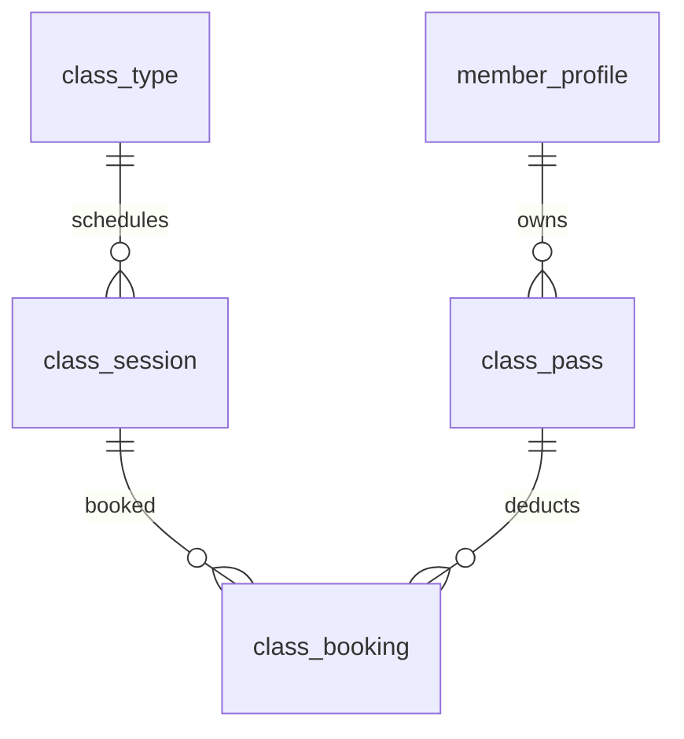

# P6 — Booking Verticals: Group Class, PT, Private Room, Massage

> English version. Vietnamese (canonical): [`../../../vi/architecture/data-model/p6-booking-verticals.md`](../../../vi/architecture/data-model/p6-booking-verticals.md).

Sources: `modules/group-class.md`, `pt-booking.md`, `private-room.md`, `massage.md`, `business-rules.md` (BR-012…041).
Built on P5 (`booking`, `booking_resource_slot`). Each vertical has a *detail* table joined by `booking_id` plus its own resource/quota tables.

---

## A. Group Class

### `class_type`
id · code UNIQUE · name · description · created_at/updated_at.

### `class_session`
| Column | Type | Constraint |
|---|---|---|
| id | BIGINT | PK identity |
| class_type_id | BIGINT | FK class_type (intra) |
| branch_id | BIGINT | logical ref → branch |
| room_id | BIGINT | logical ref → branch.branch_room |
| instructor_id | BIGINT | logical ref → staff |
| start_time / end_time | timestamptz | NOT NULL, CHECK(end>start) |
| capacity | INT | NOT NULL CHECK (>0) |
| booked_count | INT | NOT NULL DEFAULT 0, CHECK (booked_count>=0 AND booked_count<=capacity) |
| status | VARCHAR(20) | NOT NULL DEFAULT 'SCHEDULED', CHECK IN ('SCHEDULED','OPEN_FOR_BOOKING','FULL','ONGOING','COMPLETED','CANCELLED') |
| created_at/updated_at | timestamptz | trigger |

- **Room/instructor conflict (BR-029)** — EXCLUDE on the schedule itself:
  - `EXCLUDE USING gist (room_id WITH =, tstzrange(start_time,end_time) WITH &&) WHERE (status <> 'CANCELLED')`
  - `EXCLUDE USING gist (instructor_id WITH =, tstzrange(start_time,end_time) WITH &&) WHERE (status <> 'CANCELLED')`
- **Class full (BR-028)** — atomic:
  `UPDATE class_session SET booked_count=booked_count+1 WHERE id=:id AND booked_count<capacity;` (0 rows ⇒ FULL).

### `class_pass`
id · code UNIQUE · member_id (logical→member) · class_type_scope BIGINT NULL FK class_type (intra; NULL=any class) · total_sessions INT CHECK(>0) · remaining_sessions INT CHECK(>=0) · valid_from/valid_to · status CHECK IN ('ACTIVE','EXPIRED','USED_UP','CANCELLED') · source_order_id (logical→payment.customer_order) · created_at/updated_at.
- **Atomic session deduction (BR-026)**: `UPDATE class_pass SET remaining_sessions=remaining_sessions-1 WHERE id=:id AND remaining_sessions>0;`

### `class_booking` (detail)
id · booking_id BIGINT UNIQUE (logical→booking) · class_session_id FK class_session (intra) · member_id (logical→member) · class_pass_id FK class_pass (intra; NULL = trial benefit, BR-010) · attendance_status CHECK IN ('BOOKED','ATTENDED','NO_SHOW','CANCELLED') · created_at.
- **1 member/session**: `UNIQUE(class_session_id, member_id)`.
- Valid cancel ⇒ `booked_count-1` + restore `remaining_sessions+1` (1 transaction). No-show ⇒ loses the session.

---

## B. PT (1-on-1, 90 min, 06:00–22:00)

### `trainer_profile`
id · staff_id BIGINT UNIQUE (logical→staff) · branch_id (logical→branch) · level · specialties TEXT · price_per_session NUMERIC(14,2) · currency · status CHECK IN ('ACTIVE','INACTIVE') · created_at/updated_at.

### `trainer_availability`
id · trainer_id FK trainer_profile (intra) · branch_id (logical→branch) · day_of_week SMALLINT CHECK (0..6) · start_time TIME · end_time TIME · CHECK (start_time>='06:00' AND end_time<='22:00' AND end_time>start_time). (BR-032/033)

### `pt_booking` (detail)
id · booking_id BIGINT UNIQUE (logical→booking) · trainer_id FK trainer_profile (intra) · duration_minutes INT DEFAULT 90 · price · currency · completed_by_trainer_at · created_at.
- **PT overlap**: one slot `('TRAINER', trainer_id, start, end)` in `booking_resource_slot` ⇒ EXCLUDE blocks double-book.
- 06:00–22:00 + 90' validated in the application (vs `trainer_availability`).

### `pt_rating`
id · booking_id UNIQUE (logical→booking) · member_id (logical→member) · trainer_id FK trainer_profile (intra) · rating SMALLINT CHECK (1..5) · comment · author_visible_to_trainer BOOLEAN DEFAULT false · created_at.
- **BR-035**: PT cannot see the author (`author_visible_to_trainer=false`); manager via `RATING_VIEW_AUTHOR`.

---

## C. Private Room (hourly, ≤2h, monthly VIP quota)

### `private_room`
id · code UNIQUE · branch_id (logical→branch) · room_id (logical→branch.branch_room) · name · capacity · hourly_price · status CHECK IN ('AVAILABLE','BOOKED','IN_USE','CLEANING','MAINTENANCE','CLOSED') · created_at/updated_at.

### `private_room_quota` (monthly VIP quota — BR-013)
id · member_id (logical→member) · year_month DATE (1st of month) · total_minutes INT CHECK(>=0) · used_minutes INT DEFAULT 0 CHECK (used_minutes>=0 AND used_minutes<=total_minutes) · created_at/updated_at · UNIQUE(member_id, year_month).
- **Atomic deduction (BR-013)**: `UPDATE private_room_quota SET used_minutes=used_minutes+:d WHERE member_id=:m AND year_month=:ym AND used_minutes+:d<=total_minutes;`

### `private_room_booking` (detail)
id · booking_id UNIQUE (logical→booking) · private_room_id FK private_room (intra) · duration_minutes INT CHECK (>0 AND **<=120**) · quota_used_minutes · paid_extra_amount · created_at.
- **≤2h (BR-014)** = CHECK 120'. Room double-book: slot `('PRIVATE_ROOM', private_room_id, ...)` ⇒ EXCLUDE.

---

## D. Massage (VIP 3 free/week, room + staff)

### `massage_service`
id · code UNIQUE · name · internal_duration_minutes · price · currency · active. (BR-040 internal config)

### `massage_room`
id · branch_id (logical→branch) · room_id (logical→branch.branch_room) · name · status CHECK IN ('AVAILABLE','CLEANING','MAINTENANCE','CLOSED') · created_at/updated_at.

### `massage_staff_availability`
id · staff_id (logical→staff) · branch_id (logical→branch) · day_of_week SMALLINT CHECK(0..6) · start_time TIME · end_time TIME CHECK(end>start).

### `massage_weekly_usage` (weekly quota — BR-015)
id · member_id (logical→member) · week_start_date DATE (Monday) · free_used_count INT DEFAULT 0 CHECK(>=0) · created_at/updated_at · UNIQUE(member_id, week_start_date).
- **Atomic free deduction (BR-016, limit=3 configurable)**: `UPDATE massage_weekly_usage SET free_used_count=free_used_count+1 WHERE member_id=:m AND week_start_date=:w AND free_used_count<:limit;` (0 rows ⇒ must pay).

### `massage_booking` (detail — 2 resources)
id · booking_id UNIQUE (logical→booking) · massage_service_id FK massage_service (intra) · massage_room_id FK massage_room (intra) · massage_staff_id (logical→staff) · free_quota_used BOOLEAN · paid_amount · created_at.
- **Room & staff conflict (BR-041)**: insert **2 rows** in `booking_resource_slot`: `('MASSAGE_ROOM', room_id, ...)` and `('MASSAGE_STAFF', staff_id, ...)` ⇒ EXCLUDE blocks both.

---

## P6 race-condition summary
| Mechanism | Table | Protects |
|---|---|---|
| EXCLUDE gist | booking_resource_slot | overlap for trainer/private_room/massage room+staff |
| EXCLUDE gist | class_session | room/instructor overlap of the class schedule |
| atomic `booked_count<capacity` | class_session | class full |
| atomic `remaining_sessions>0` | class_pass | double session deduction |
| atomic `used_minutes+d<=total` | private_room_quota | VIP quota overrun |
| atomic `free_used_count<limit` | massage_weekly_usage | over 3 free/week |
| UNIQUE(session, member) | class_booking | duplicate class booking |

## Planned migrations
`V014__group_class.sql` · `V015__pt.sql` · `V016__private_room.sql` · `V017__massage.sql`.
