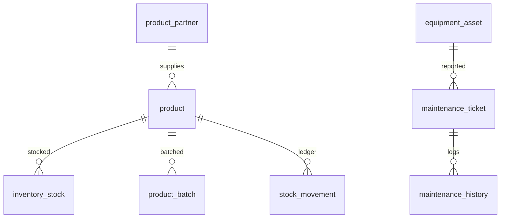

# P7 — Inventory / POS / Pantry / Equipment & Maintenance

> English version. Vietnamese (canonical): [`../../../vi/architecture/data-model/p7-inventory-pantry-equipment.md`](../../../vi/architecture/data-model/p7-inventory-pantry-equipment.md).

Sources: `modules/inventory-pantry.md`, `equipment-maintenance.md`, `business-rules.md` (BR-047…054).

## Scope
Inventory/POS: `product_partner`, `product`, `inventory_stock`, `stock_movement`, `product_batch`, `purchase_order(+item)`, `stock_transfer`, `stock_adjustment`.
Pantry: reuses `product` (type PANTRY) + `product_batch`. POS sale reuses `order`/`order_item` (P3).
Equipment: `equipment_asset`, `maintenance_ticket`, `maintenance_history`.

## ERD

## Inventory / POS

### `product_partner`
id · code UNIQUE · name · type CHECK IN ('PARTNER','BRAND') · contact · active BOOLEAN · created_at/updated_at.

### `product`
id · sku UNIQUE · name · category · product_type CHECK IN ('GYM_SUPPORT','SUPPLEMENT','PANTRY') · partner_id FK product_partner (intra) · price · currency · is_pantry · track_batch (pantry=true) · active · created_at/updated_at.

### `inventory_stock` (stock per branch — BR-048)
| Column | Type | Constraint |
|---|---|---|
| id | BIGINT | PK identity |
| product_id | BIGINT | FK product (intra) |
| branch_id | BIGINT | logical ref → branch |
| quantity | INT | NOT NULL DEFAULT 0, **CHECK (quantity>=0)** |
| low_stock_threshold | INT | DEFAULT 0 |
| version | BIGINT | NOT NULL DEFAULT 0 |
| created_at/updated_at | timestamptz | trigger |
- `UNIQUE(product_id, branch_id)`.
- **Atomic deduction (BR-049)**: `UPDATE inventory_stock SET quantity=quantity-:q WHERE product_id=:p AND branch_id=:b AND quantity>=:q;` (0 rows ⇒ `OUT_OF_STOCK`).

### `stock_movement` (ledger)
id · product_id FK product (intra) · branch_id (logical→branch) · movement_type CHECK IN ('IMPORT','SALE','TRANSFER_IN','TRANSFER_OUT','ADJUSTMENT','RETURN') · quantity INT (signed) · reference_type · reference_id · created_by (logical→staff) · created_at.

### `product_batch` (pantry expiry/lot — BR-051)
id · product_id FK product (intra) · branch_id (logical→branch) · batch_no · expiry_date DATE · quantity INT CHECK(>=0) · created_at/updated_at · UNIQUE(product_id, branch_id, batch_no). Deduct per batch atomically (FEFO by expiry).

### `purchase_order` + `purchase_order_item`
purchase_order: id · po_code UNIQUE · partner_id FK product_partner (intra) · branch_id (logical→branch) · status CHECK IN ('DRAFT','ORDERED','RECEIVED','CANCELLED') · total_amount · created_at/updated_at.
purchase_order_item: id · purchase_order_id FK (intra) · product_id FK product (intra) · quantity CHECK(>0) · unit_cost · line_amount.

### `stock_transfer`
id · code UNIQUE · product_id FK product (intra) · from_branch_id / to_branch_id (logical→branch, CHECK from<>to) · quantity CHECK(>0) · status CHECK IN ('DRAFT','IN_TRANSIT','COMPLETED','CANCELLED') · created_at/updated_at.

### `stock_adjustment`
id · code UNIQUE · product_id FK product (intra) · branch_id (logical→branch) · quantity_delta INT · reason TEXT · created_by (logical→staff) · created_at. (Every adjustment is audited — P8.)

> **POS sale**: create `customer_order`(order_type POS_PRODUCT/PANTRY) + `order_item` + `payment` (P3); on PAID → write `stock_movement(SALE)` + atomic deduct `inventory_stock`/`product_batch` in one transaction. Pantry checks the 06:00–22:00 window in the application (BR-050).

## Equipment & Maintenance

### `equipment_asset`
| Column | Type | Constraint |
|---|---|---|
| id | BIGINT | PK identity |
| asset_code | VARCHAR(40) | UNIQUE NOT NULL |
| name | VARCHAR(150) | NOT NULL |
| category | VARCHAR(60) | |
| branch_id | BIGINT | logical ref → branch |
| room_id | BIGINT | logical ref → branch.branch_room |
| area | VARCHAR(60) | NULL |
| status | VARCHAR(20) | NOT NULL DEFAULT 'ACTIVE', CHECK IN ('ACTIVE','NEED_MAINTENANCE','UNDER_MAINTENANCE','BROKEN','RETIRED') |
| purchase_date | DATE | NULL |
| supplier | VARCHAR(150) | NULL |
| next_maintenance_date | DATE | NULL |
| qr_code | VARCHAR(80) | NULL (scan to report) |
| created_at/updated_at | timestamptz | trigger |

### `maintenance_ticket`
id · ticket_code UNIQUE · equipment_id FK equipment_asset (intra) · branch_id (logical→branch) · reporter_type CHECK IN ('STAFF','MEMBER') · reported_by BIGINT · assigned_to (logical→staff) · issue_description TEXT · image_url VARCHAR(255) (S3) · status CHECK IN ('NEW','ASSIGNED','IN_PROGRESS','WAITING_CUSTOMER','RESOLVED','CLOSED') · priority CHECK IN ('LOW','MEDIUM','HIGH','URGENT') · cost NUMERIC(14,2) NULL · resolved_at · created_at/updated_at. (status-flow Ticket)

### `maintenance_history`
id · equipment_id FK equipment_asset (intra) · ticket_id FK maintenance_ticket (intra) · action · note · cost · performed_by (logical→staff) · performed_at · created_at.

## Race conditions (P7)
- `inventory_stock.quantity>=0` + atomic deduction; `product_batch.quantity>=0`.
- POS payment idempotency (P3) → avoid double stock deduction.
- `UNIQUE(product_id, branch_id)` for stock.

## Planned migrations
`V018__product_inventory.sql` · `V019__purchase_transfer_adjust.sql` · `V020__equipment_maintenance.sql`.
