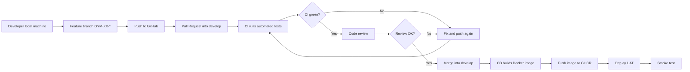
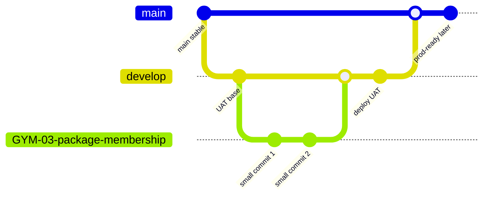
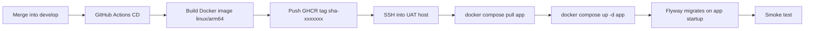

# Commit, CI/CD, And UAT Deployment Workflow

## 1. Who This Guide Is For

This guide is for new developers joining the team who may not yet be comfortable with Git, CI/CD, Docker, or deployment workflows. After reading it, you should understand how a code change moves from your local machine to automated checks, review, Docker image build, and UAT verification.

This guide explains the **development and release workflow**. Infrastructure setup details such as creating a VM, configuring Cloudflare Tunnel, secrets, domain names, or firewall rules should live in a separate infrastructure runbook, for example `DEPLOY-UAT.md` when the team adds it.

Related documents:
- [`deployment-quick-runbook.md`](deployment-quick-runbook.md): copy-paste command runbook from commit to UAT.
- [`deployment-configuration-guide.md`](deployment-configuration-guide.md): per-file deployment configuration guide.

## 2. Big Picture

A pipeline is a repeatable chain of manual and automated steps that moves code from a developer machine to a test environment. The goal is to avoid relying on memory: code must pass tests, pass review, be packaged as a clearly tagged artifact, and only then be deployed.



Why this pipeline exists:
- **Quality**: CI runs the same checks for everyone, avoiding "it works on my machine".
- **Automation**: image build and deployment should not be repeated manually every time.
- **Rollback**: images are tagged by git SHA, so UAT can return to a known good version.

## 3. Team Branching Model

Recommended branching model for gym-platform:



Conventions:
- `main`: production-ready branch.
- `develop`: UAT integration branch. Feature branches merge here for UAT deployment.
- `GYM-XX-*`: feature branch, for example `GYM-03-package-membership`.

Repository state on 2026-07-08:
- `.github/workflows/ci.yml` supports `main`, `develop`, `feature/**`, and `codex/**`.
- `.github/workflows/docker-image.yml` currently builds an image on push to `main`.
- There is no SSH deployment `.github/workflows/cd.yml` yet.

So this document describes the **target workflow**. To deploy UAT automatically from `develop`, the team must add `cd.yml` or adjust the existing workflow to trigger from `develop`.

## 4. Local Machine Preparation

Your local machine needs:
- Git for branches and commits.
- JDK 26 for the Spring Boot API.
- Docker Desktop for PostgreSQL, Keycloak, and local UAT compose.
- The Maven wrapper already committed in the repo: `./mvnw`.

Clone the repo:

```bash
git clone git@github.com:diepchu1999/gym-platform.git
cd gym-platform
```

Check Java:

```bash
java --version
```

Expected: Java 26.

Run backend verification:

```bash
cd gym-platform-api
./mvnw -q -B verify
```

Running tests locally before pushing gives faster feedback and keeps PRs cleaner.

## 5. Branch And Commit Conventions

Branch format:

```text
GYM-<ticket-number>-<short-name>
```

Examples:

```text
GYM-03-package-membership
GYM-12-keycloak-uat
GYM-21-staff-rbac
```

Commit messages should be clear and small:

```text
feat: add package plan create API
fix: validate package duration
docs: add UAT deployment workflow
```

Small commits make review, debugging, and rollback easier.

Do not commit:
- Real passwords.
- Private keys.
- Tokens.
- `.env` files containing real secrets.

## 6. Daily Workflow

### 6.1. Update The Integration Branch

**Command**

```bash
git checkout develop
git pull origin develop
```

**What happens**

You switch to `develop` and pull the latest code from GitHub.

**Why**

Feature branches should start from the latest integration branch to reduce merge conflicts.

**How to verify**

```bash
git status
```

Expected:

```text
On branch develop
nothing to commit, working tree clean
```

If `develop` does not exist yet:

```bash
git checkout main
git pull origin main
git checkout -b develop
git push -u origin develop
```

### 6.2. Create A Feature Branch

**Command**

```bash
git checkout -b GYM-XX-short-feature-name
```

Example:

```bash
git checkout -b GYM-29-deployment-workflow-doc
```

**What happens**

Git creates a new branch from `develop`.

**Why**

A separate branch keeps unfinished work away from the integration branch.

**How to verify**

```bash
git branch --show-current
```

Expected:

```text
GYM-29-deployment-workflow-doc
```

### 6.3. Code And Run Local Tests

**Command**

```bash
cd gym-platform-api
./mvnw -q -B verify
```

Run the architecture guardrail when needed:

```bash
./mvnw -q -B test -Dtest=com.gym.architecture.ArchitectureRulesTest
```

**What happens**

Maven builds the app and runs tests. `ArchitectureRulesTest` reads Java source files and blocks Hexagonal Architecture violations such as application importing adapter, domain importing frameworks, or one module importing another module's internals.

**Why**

gym-platform is a modular monolith. Breaking module boundaries makes the system harder to maintain and scale.

**How to verify**

The command exits with code `0` and no `[ERROR]` lines.

### 6.4. Review Your Diff Before Commit

**Command**

```bash
git status
git diff
```

**What happens**

You inspect changed files and the actual diff.

**Why**

This prevents accidentally committing unrelated files, generated files, or secrets.

**How to verify**

Only files related to the current task appear in `git status`.

### 6.5. Commit

**Command**

```bash
git add <file-1> <file-2>
git commit -m "docs: add deployment workflow guide"
```

**What happens**

Git stores a snapshot on your current branch.

**Why**

Commits are the unit of history. CI, review, and rollback all refer to commits.

**How to verify**

```bash
git log --oneline -5
```

The newest commit should be yours.

### 6.6. Push The Branch

**Command**

```bash
git push -u origin GYM-XX-short-feature-name
```

**What happens**

Your local branch is pushed to GitHub.

**Why**

GitHub needs to see your branch before you can open a Pull Request.

**How to verify**

GitHub shows an option to open a Pull Request for the pushed branch.

### 6.7. Open A Pull Request Into develop

**Manual action**

On GitHub:
1. Open the `gym-platform` repository.
2. Go to **Pull requests**.
3. Click **New pull request**.
4. Base branch: `develop`.
5. Compare branch: your `GYM-XX-*` branch.
6. Write the PR description.
7. Create the PR.

**What happens**

A PR asks the team to merge your branch into `develop`.

**Why**

A PR creates a review and CI checkpoint.

**How to verify**

The PR direction must be:

```text
GYM-XX-* -> develop
```

### 6.8. Read CI Results

**Automated**

GitHub Actions runs `.github/workflows/ci.yml` for PRs into `develop`.

CI currently:
- Starts a PostgreSQL service.
- Sets up Java 26.
- Runs `./mvnw -q -B verify`.
- Runs tests, Spring context, Flyway migration validation, and architecture guardrails.

**Why**

CI is an automated guardrail before code enters the integration branch.

**How to verify**

In the PR, check **Checks**:
- Green: continue review/merge.
- Red: open the failed job and read logs.

When CI is red, look for the first `[ERROR]`. The final line is often only a summary.

### 6.9. Code Review

**Manual action**

Reviewers read the PR and leave comments if needed.

Self-checklist before asking for review:
- Does the code follow documented business rules?
- Is business logic kept out of controllers?
- Are module/layer imports valid?
- Does persistence use Native SQL and not JPA Repository?
- Is a DB change a new migration, not an edited old one?
- Does the API return DTO/view objects instead of raw DB rows?
- Are tests added or explicitly deferred?
- Are docs updated if behavior changed?

**Why**

CI catches clear technical failures. Review catches design, business, and maintainability issues.

### 6.10. Address Review And Push Again

**Command**

```bash
# edit code
git status
git add <files>
git commit -m "fix: address review comments"
git push
```

**What happens**

You add another commit to the same PR. GitHub runs CI again.

**Why**

Every review change must pass the same guardrails.

**How to verify**

The PR shows the new commit and a new green CI run.

### 6.11. Merge Into develop

**Manual action**

When CI is green and review is approved, click **Merge**.

Recommended for small feature PRs: **Squash and merge**.
- It keeps `develop` history clean.
- One PR becomes one summary commit.

Use **Merge commit** when preserving individual commits matters.

**Why not push directly to develop**

Direct push bypasses PR, review, and CI checkpoints. That is risky for a modular codebase with migrations.

## 7. What CI Runs

Current file: `.github/workflows/ci.yml`.

Current triggers:

```yaml
on:
  push:
    branches:
      - main
      - develop
      - "feature/**"
      - "codex/**"
  pull_request:
    branches:
      - main
      - develop
```

Main job:

```text
API build and tests
```

CI starts PostgreSQL and runs:

```bash
./mvnw -q -B verify
```

CI does not need a real Keycloak container for the current tests because the app is configured with JWT/JWK environment variables and does not need to call Keycloak during test startup.

Common CI failure groups:
- Logic/test failure.
- `ArchitectureRulesTest` import violation.
- Flyway migration failure.
- Spring context or bean configuration failure.

## 8. Code Review And Merge

Review is not just typo checking. It protects maintainability.

The PR author should describe:
- What the task changes.
- Which APIs or migrations changed.
- Which tests were run.
- Anything the reviewer should inspect carefully.

Example PR description:

```md
## Summary
- Add package plan create API.
- Add Flyway migration for package plan permissions.

## Verification
- ./mvnw -q -B verify
- ArchitectureRulesTest passed

## Notes
- No JPA repository added.
```

## 9. CD After Merge Into The Integration Branch

CD means Continuous Deployment or Continuous Delivery: a pipeline builds an artifact and deploys it to a running environment.

Target CD for gym-platform:



Step meanings:
- **Build Docker image**: packages the Java 26 app into a runnable image.
- **linux/arm64**: required for Oracle Always-Free ARM or ARM machines. For x86_64 VPS, also build `linux/amd64`.
- **Push GHCR**: stores the image in GitHub Container Registry.
- **Git SHA tag**: for example `sha-f74088d`; immutable and rollback-friendly.
- **SSH deploy**: GitHub Actions logs into the UAT host and runs Docker Compose.
- **Flyway migrate**: the app applies DB migrations during startup.

Current prerequisites:
- The repo does not yet have `.github/workflows/cd.yml`.
- `docker-image.yml` currently builds and pushes images on `main`, but does not SSH deploy.
- To deploy UAT automatically from `develop`, add `cd.yml` or adjust the existing workflow.

Target deploy commands on the UAT host:

```bash
docker compose \
  --env-file infra/docker/.env.uat \
  -f infra/docker/docker-compose.uat.yml \
  pull app

docker compose \
  --env-file infra/docker/.env.uat \
  -f infra/docker/docker-compose.uat.yml \
  up -d app
```

With the temporary MacBook + Cloudflare Tunnel UAT, the equivalent action is updating `APP_TAG` in `infra/docker/.env.uat`, pulling the new image, and running `up -d app`.

## 10. Docker Image, GHCR, And Git SHA Tags

A Docker image is the runtime package for the app: JRE, jar, dependencies, and startup command.

GHCR is GitHub Container Registry:

```text
ghcr.io/diepchu1999/gym-platform-api
```

A tag identifies an image version:

```text
ghcr.io/diepchu1999/gym-platform-api:sha-f74088d
```

Do not rely on `latest` as the primary deployment tag. `latest` changes over time, so it is hard to know exactly what was running before an incident. Git SHA tags solve that.

## 11. Current gym-platform UAT

UAT is the pre-production test environment. It should be close enough to production to catch integration issues: real app, real DB, real Keycloak, real Docker image.

Current temporary UAT:

```text
MacBook
  -> Docker Compose UAT
      -> app
      -> postgres
      -> keycloak
  -> Cloudflare Tunnel
      -> public API URL
      -> public Keycloak URL
```

Strengths:
- No server cost.
- Public HTTPS testing works.
- Keycloak token testing works through Postman.

Limits:
- If the MacBook sleeps or loses network, UAT is down.
- Quick Tunnel URLs can change after restart.
- Not suitable for long-running team testing.

Future target:

```text
VM/VPS
  -> Docker Compose UAT
  -> Cloudflare Tunnel or HTTPS domain
  -> CD deployment over SSH
```

## 12. Post-Deploy Verification

After every UAT deployment, run smoke tests. A smoke test is a quick check that the system is alive and core flows still work.

### 12.1. Check Containers

```bash
docker compose \
  --env-file infra/docker/.env.uat \
  -f infra/docker/docker-compose.uat.yml \
  ps
```

Expected:

```text
postgres   healthy
keycloak   healthy
app        healthy
```

### 12.2. Check App Logs

```bash
docker compose \
  --env-file infra/docker/.env.uat \
  -f infra/docker/docker-compose.uat.yml \
  logs --tail 120 app
```

Expected:

```text
Started GymPlatformApiApplication
Schema "public" is up to date
```

### 12.3. Check Health

```bash
curl -i https://<api-public-url>/actuator/health
```

Expected:

```http
HTTP/2 200
```

Body includes:

```json
"status":"UP"
```

### 12.4. Get A Keycloak Token

Use Postman OAuth2:

```text
Grant Type: Authorization Code (With PKCE)
Auth URL: https://<kc-public-url>/realms/gym-platform/protocol/openid-connect/auth
Access Token URL: https://<kc-public-url>/realms/gym-platform/protocol/openid-connect/token
Client ID: gym-dev-cli
Scope: openid profile email roles
Callback URL: https://oauth.pstmn.io/v1/callback
```

### 12.5. Verify APIs

Without token:

```http
GET https://<api-public-url>/api/v1/admin/branches
```

Expected:

```http
401 Unauthorized
```

With token:

```http
GET https://<api-public-url>/api/v1/me
```

Expected:

```http
200 OK
```

Package plan:

```http
GET https://<api-public-url>/api/v1/admin/package-plans
```

Expected:
- `200 OK` if the user has permission.
- `403 Forbidden` if the token is valid but permission is missing.

Create package plan:

```http
POST https://<api-public-url>/api/v1/admin/package-plans
```

Expected:
- User needs `PACKAGE_MANAGE`.
- Without permission, `403 Forbidden` is correct.

Deployment is successful when:
- App container is healthy.
- Flyway has no error.
- Health endpoint returns `200`.
- Keycloak token can be obtained.
- Protected APIs return correct `401/403/200` results.

## 13. Rollback When UAT Breaks

Rollback means returning UAT to a previously known good image.

### 13.1. Find The Old Tag

Open GitHub Packages:

```text
ghcr.io/diepchu1999/gym-platform-api
```

Pick the old tag, for example:

```text
sha-d158dff
```

### 13.2. Change APP_TAG

On the UAT host or local MacBook UAT, open:

```text
infra/docker/.env.uat
```

Change:

```env
APP_TAG=sha-d158dff
```

### 13.3. Pull And Restart App

```bash
docker compose \
  --env-file infra/docker/.env.uat \
  -f infra/docker/docker-compose.uat.yml \
  pull app

docker compose \
  --env-file infra/docker/.env.uat \
  -f infra/docker/docker-compose.uat.yml \
  up -d app
```

### 13.4. Verify Again

```bash
docker compose \
  --env-file infra/docker/.env.uat \
  -f infra/docker/docker-compose.uat.yml \
  ps

curl -i https://<api-public-url>/actuator/health
```

Important: rolling back the app does not automatically roll back database migrations. Migrations should be backward-compatible when possible, and old applied migrations must not be edited.

## 14. Common Issues

| Issue | Symptom | Common Cause | Fix |
|---|---|---|---|
| CI red due to tests | GitHub Actions fails in `Verify` | Logic or test expectation is wrong | Open logs, find the first `[ERROR]`, fix and push again |
| ArchitectureRulesTest fails | Message contains `[R1]`, `[R2]`, `[R3]`... | Invalid module/layer import | Fix dependency according to Hexagonal Architecture |
| Flyway fails | App/CI reports migration error | SQL error, duplicate version, edited old migration | Create a new migration; do not edit applied files |
| Spring context fails | `ApplicationContext` does not boot | Bean/config/env issue | Read the first bean failure in stacktrace |
| Wrong image architecture | Server pull/run platform error | Built `arm64` for `amd64`, or reverse | Build multi-arch `linux/amd64,linux/arm64` |
| GHCR pull denied | `denied` or `unauthorized` | Package private or not logged in | Login to GHCR or change package visibility |
| Token returns 401 | API rejects token | JWT `iss` does not match `KEYCLOAK_ISSUER_URI` | Compare `.well-known` issuer and app env |
| Keycloak not ready | Login/token fails after restart | Keycloak is still booting | Wait for health, read keycloak logs |
| Cloudflare URL dead | Public URL not reachable | Tunnel stopped, Mac slept, network lost | Restart tunnel; Quick Tunnel URL may change |

## 15. Glossary For New Developers

- **Branch**: a separate line of code history.
- **Feature branch**: a branch for one task or feature.
- **Pull Request (PR)**: a request to merge one branch into another with checks and review.
- **Merge**: bringing code from one branch into another.
- **Squash merge**: combining all PR commits into one commit during merge.
- **CI**: Continuous Integration, automated build and test on push/PR.
- **CD**: Continuous Deployment/Delivery, automated artifact build and deployment.
- **Pipeline**: ordered automated steps such as test, build, push image, deploy.
- **Artifact**: build output, such as a Docker image.
- **Docker image**: runnable package of the app and runtime.
- **Tag**: image version label, for example `sha-f74088d`.
- **Registry**: storage for Docker images.
- **GHCR**: GitHub Container Registry.
- **Guardrail**: automated safety check, such as `ArchitectureRulesTest`.
- **Migration**: versioned SQL change to the database.
- **Flyway**: tool that runs migrations in order.
- **UAT**: User Acceptance Testing environment before production.
- **Rollback**: returning to a previous app version.
- **Smoke test**: quick post-deploy check that the system is alive.
- **Secret**: sensitive value such as password, token, or private key.

## 16. One UAT Release Checklist

Before opening PR:

```text
[ ] Branch starts from develop
[ ] Code follows business rules/docs
[ ] Diff contains no secret
[ ] DB change uses a new migration, not edited old migration
[ ] No JPA Repository added
[ ] ./mvnw -q -B verify passes locally
```

When opening PR:

```text
[ ] PR target is develop
[ ] PR description is clear
[ ] CI is green
[ ] Review comments are addressed
[ ] Merge uses Squash and merge or the team-approved strategy
```

After merge:

```text
[ ] CD or Docker Image workflow is green
[ ] GHCR has the new sha tag
[ ] UAT pulled the correct APP_TAG
[ ] app/keycloak/postgres containers are healthy
[ ] /actuator/health returns 200
[ ] Keycloak token can be obtained
[ ] GET /api/v1/me returns 200
[ ] Protected APIs return correct 401/403/200 results
```

When there is an incident:

```text
[ ] Read app/keycloak logs
[ ] Check JWT issuer
[ ] Check migration/Flyway
[ ] Roll back APP_TAG to an older git SHA if needed
```
