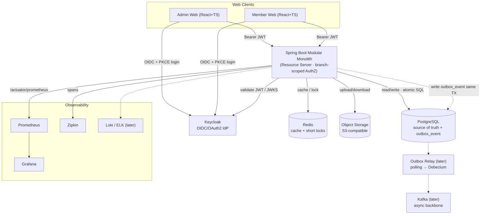

# Solution Architecture

> English version. Vietnamese (canonical): [`../../vi/architecture/solution-architecture.md`](../../vi/architecture/solution-architecture.md).
> Canonical diagram: [`diagrams/solution_architecture.svg`](../../diagrams/solution_architecture.svg)
> Status: PROPOSED — aligned to the owner's architecture diagram.

## 1. Purpose
Target technical architecture of gym-platform. It stays a **Spring Boot Modular Monolith** (one deployable backend). Supporting infrastructure: **Keycloak** (authentication/OIDC), **PostgreSQL** (source of truth), **Redis** (cache + short-lived locks), **Object Storage** (S3-compatible, documents/images), a **Transactional Outbox** (now), and **Kafka** as an async backbone (**later**). Observability via **Prometheus + Grafana** and **Zipkin** (+ Loki/ELK for logs later). None of these are microservices.

## 2. Architecture principles
- Modular Monolith first: one deployable Spring Boot app, modules under `com.gym.*`.
- Core flows (payment, contract, booking, check-in, quota, stock) keep **strong consistency** via **PostgreSQL transactions + atomic SQL / constraints**.
- **Authentication** is delegated to Keycloak. **Branch-scoped authorization stays inside the internal `identity` module** (role · branch scope · ownership · fine-grained permission).
- **Redis** handles ephemeral, performance-critical concerns (QR token TTL, one-time nonce, duplicate-scan lock, rate limiting). **Durable uniqueness stays in PostgreSQL** (e.g. 1 trial/CCCD, payment txn id).
- **Object Storage** holds binary documents; the DB stores only the **object key/URL**.
- Async side-effects are captured **now** via a **Transactional Outbox**; **Kafka** delivery is added **later** without breaking the seam.

## 3. High-level context

## 4. Logical components

| Component | Responsibility | Now/Later |
|---|---|---|
| Admin/Member Web | React+TS SPA, OIDC login (PKCE) | now |
| Keycloak | AuthN, tokens, MFA, sessions | now |
| API Monolith | Business modules, resource server, branch-scoped authZ | now |
| PostgreSQL | Source of truth + `outbox_event` | now |
| Redis | Cache + short locks (QR TTL, nonce, dup-scan, rate limit) | now |
| Object Storage (S3) | CCCD/student images, contract PDF, invoices, media | now |
| Transactional Outbox | Capture domain events in the business TX | now |
| Outbox Relay + Kafka | Publish + async backbone (notification, audit, report, CRM) | **later** |
| Prometheus / Grafana | Metrics + dashboards/alerts | now |
| Zipkin | Distributed tracing | now |
| Loki / ELK | Centralized logs | **later** |

## 5. Authentication & Authorization
**Keycloak = authentication; the app = authorization (confirmed by the architecture diagram).**
- Realm `gym-platform`; clients `gym-admin-web`, `gym-member-web` (public + PKCE); API = OAuth2 **resource server** validating JWT via JWKS.
- The app maps JWT `sub` → internal principal, then the **`identity` module** enforces: **Role · Branch scope · Ownership · Fine-grained permission** using `rbac_*` + `staff_branch_assignment`.
- No passwords in the app DB; `identity_user_account` maps internal id ↔ `keycloak_user_id`. (See `data-model/p1-identity-org.md`.)

## 6. Data stores & runtime support
- **PostgreSQL** — source of truth: business tables, constraints & indexes, ACID transactions, atomic SQL. Holds `outbox_event`.
- **Redis** — cache & short-lived locks: **QR token TTL**, **one-time nonce**, **duplicate-scan lock**, **rate limiting**. A performance/ephemeral layer; it does **not** replace durable DB constraints. Authoritative race protection (trial-once-per-CCCD, payment idempotency, class booking uniqueness, stock/quota) stays in PostgreSQL (see `CLAUDE.md`).
- **Object Storage (S3)** — CCCD / student card images, contract PDF, invoice/receipt, equipment/product images. The DB stores only the object key/URL; sensitive objects are RBAC-controlled and reads/writes audited.

## 7. Async eventing — Outbox now, Kafka later
- **Now**: business modules append events to **`outbox_event`** within the **same DB transaction** as the business change → "event recorded iff business change committed". Nothing is lost even before Kafka exists.
- **Later**: an **Outbox Relay** (polling first, **Debezium CDC** later) publishes committed events to **Kafka**, where async consumers react (notification, audit, report, CRM). Consumers must be **idempotent**.
- Core consistency-critical decisions are **never** moved to Kafka — they stay transactional in PostgreSQL. Kafka only carries resulting facts.

## 8. Observability
Metrics: Micrometer/Actuator `/actuator/prometheus` → **Prometheus** → **Grafana** (JVM, HTTP, DB pool, business KPIs; Kafka lag later). Tracing: Micrometer Tracing (Brave/OTel) → **Zipkin**, context propagated over HTTP (and Kafka later). Logs: structured with `traceId`/`spanId`; centralized **Loki/ELK later**.

## 9. Local development topology
`infra/docker/docker-compose.yml` provides: `postgres`, `pgadmin`, `keycloak`, `redis`, `minio` (S3) + `minio-setup`, `prometheus`, `grafana`, `zipkin`. **Kafka is deferred** (commented block). The Spring app runs on the host (port 8080); Keycloak is mapped to 8085 to avoid clashing.

## 10. Decisions status
| # | Decision | Status |
|---|---|---|
| 1 | Hybrid: Keycloak authN + app branch-scoped authZ | ✅ Confirmed by diagram |
| 2 | Async: Transactional Outbox now, Kafka later (polling → Debezium) | ✅ Per diagram |
| 3 | Redis for cache + short locks (durable uniqueness stays in PostgreSQL) | ✅ → ADR-0009 |
| 4 | Object Storage (S3) for documents/images; DB stores object key only | ✅ → ADR-0010 |
| 5 | CLAUDE.md baseline updated with adopted supporting infra | ✅ |

ADRs: **0006** Keycloak · **0007** Outbox-now/Kafka-later · **0008** Observability · **0009** Redis · **0010** Object Storage · **0011** Schema-per-module.
