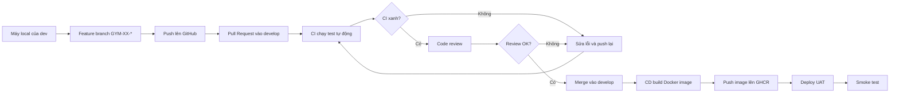
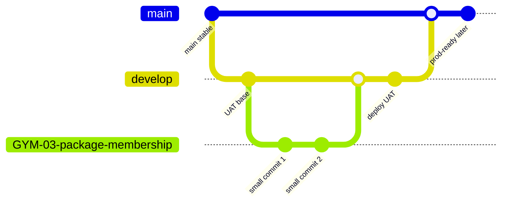
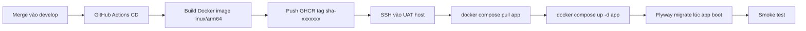

# Quy Trình Commit, CI/CD Và Deploy UAT

> Bản tiếng Việt (canonical). English: [`../../en/architecture/deployment-workflow.md`](../../en/architecture/deployment-workflow.md).

## 1. Tài liệu này dành cho ai

Tài liệu này dành cho dev mới vào team, chưa cần rành Git, CI/CD hay Docker. Đọc xong tài liệu này, bạn sẽ biết cách đi từ một thay đổi code trên máy local đến lúc thay đổi đó được kiểm tra tự động, merge vào nhánh tích hợp, build thành Docker image và deploy lên UAT để test.

Tài liệu này nói về **quy trình phát triển và release**. Phần dựng hạ tầng chi tiết như tạo VM, cấu hình Cloudflare Tunnel, secret, domain hoặc firewall sẽ nằm ở runbook hạ tầng riêng, ví dụ `DEPLOY-UAT.md` khi team bổ sung tài liệu đó.

Tài liệu liên quan:
- [`deployment-quick-runbook.md`](deployment-quick-runbook.md): bản copy lệnh chạy nhanh từ commit đến UAT.
- [`deployment-configuration-guide.md`](deployment-configuration-guide.md): giải thích từng file config để setup deploy.

## 2. Bức tranh tổng thể

Pipeline là một chuỗi bước tự động và bán tự động để đưa code từ máy dev lên môi trường test. Mục tiêu là không phụ thuộc vào trí nhớ của từng người: code phải qua test, qua review, được đóng gói thành artifact có tag rõ ràng, rồi mới deploy.



Vì sao cần pipeline này:
- **Chất lượng**: CI chạy test giống nhau cho mọi người, tránh kiểu "máy mình chạy được".
- **Tự động**: build image và deploy không cần thao tác tay lặp lại.
- **Rollback được**: image được tag bằng git SHA, nên khi UAT hỏng ta quay lại đúng bản trước đó.

## 3. Mô hình nhánh của team

Mô hình nhánh khuyến nghị cho gym-platform:



Quy ước:
- `main`: nhánh production-ready. Code ở đây phải là code đã sẵn sàng cho production hoặc gần production nhất.
- `develop`: nhánh tích hợp UAT. Feature branch merge vào đây để deploy UAT.
- `GYM-XX-*`: nhánh feature, ví dụ `GYM-03-package-membership`.

Hiện trạng repo ngày 2026-07-08:
- `.github/workflows/ci.yml` đã support `main`, `develop`, `feature/**`, `codex/**`.
- `.github/workflows/docker-image.yml` hiện build image khi push vào `main`.
- Chưa có `cd.yml` SSH deploy tự động lên UAT.

Vì vậy tài liệu này mô tả **mô hình target** của team. Để deploy UAT tự động từ `develop`, team cần bổ sung hoặc chỉnh workflow CD để trigger từ `develop`.

## 4. Chuẩn bị máy local

Trước khi code, máy local cần có:
- Git để quản lý branch và commit.
- JDK 26 để build Spring Boot API.
- Docker Desktop để chạy PostgreSQL, Keycloak và UAT compose local.
- Maven wrapper có sẵn trong repo: `./mvnw`.

Clone repo:

```bash
git clone git@github.com:diepchu1999/gym-platform.git
cd gym-platform
```

Kiểm tra Java:

```bash
java --version
```

Kỳ vọng thấy Java 26.

Chạy test backend:

```bash
cd gym-platform-api
./mvnw -q -B verify
```

Vì sao nên chạy test local trước khi push: GitHub Actions cũng sẽ chạy test, nhưng nếu bạn bắt lỗi ngay trên máy mình thì vòng feedback nhanh hơn, PR sạch hơn và reviewer đỡ mất thời gian.

## 5. Quy ước branch và commit

Tạo branch theo format:

```text
GYM-<số-ticket>-<tên-ngắn>
```

Ví dụ:

```text
GYM-03-package-membership
GYM-12-keycloak-uat
GYM-21-staff-rbac
```

Commit message nên rõ và nhỏ:

```text
feat: add package plan create API
fix: validate package duration
docs: add UAT deployment workflow
```

Commit nhỏ giúp:
- Review dễ hơn vì mỗi commit có một ý rõ.
- Debug dễ hơn khi cần tìm commit gây lỗi.
- Rollback ít rủi ro hơn vì không phải lùi một cục thay đổi quá lớn.

Không commit:
- Password thật.
- Private key.
- Token.
- File `.env` chứa secret thật.

## 6. Luồng làm việc hằng ngày

### 6.1. Cập nhật nhánh tích hợp

**Lệnh**

```bash
git checkout develop
git pull origin develop
```

**Việc gì đang xảy ra**

Bạn chuyển về `develop` và kéo code mới nhất từ GitHub.

**Vì sao**

Feature branch nên được cắt từ nền mới nhất để giảm conflict khi mở PR.

**Cách kiểm tra**

```bash
git status
```

Kỳ vọng:

```text
On branch develop
nothing to commit, working tree clean
```

Nếu repo chưa có `develop`, tạo một lần từ `main`:

```bash
git checkout main
git pull origin main
git checkout -b develop
git push -u origin develop
```

### 6.2. Tạo feature branch

**Lệnh**

```bash
git checkout -b GYM-XX-short-feature-name
```

Ví dụ:

```bash
git checkout -b GYM-29-deployment-workflow-doc
```

**Việc gì đang xảy ra**

Git tạo một branch mới từ `develop`. Mọi commit của task này sẽ nằm trên branch đó.

**Vì sao**

Branch riêng giúp task chưa xong không làm bẩn nhánh tích hợp. Team có thể review riêng từng task.

**Cách kiểm tra**

```bash
git branch --show-current
```

Kỳ vọng:

```text
GYM-29-deployment-workflow-doc
```

### 6.3. Code và chạy test local

**Lệnh**

```bash
cd gym-platform-api
./mvnw -q -B verify
```

Chạy riêng architecture guardrail khi cần kiểm tra ranh giới module:

```bash
./mvnw -q -B test -Dtest=com.gym.architecture.ArchitectureRulesTest
```

**Việc gì đang xảy ra**

Maven build app và chạy test. `ArchitectureRulesTest` đọc source Java để chặn vi phạm Hexagonal Architecture như application import adapter, domain import framework, hoặc module này import nội bộ module khác.

**Vì sao**

gym-platform là modular monolith. Nếu ranh giới module bị phá, sau này code sẽ khó scale và khó tách module.

**Cách kiểm tra**

Test pass khi command kết thúc với exit code `0` và không có dòng `[ERROR]`.

### 6.4. Xem thay đổi trước khi commit

**Lệnh**

```bash
git status
git diff
```

**Việc gì đang xảy ra**

Bạn xem file nào đã thay đổi và nội dung thay đổi là gì.

**Vì sao**

Đây là bước tự kiểm tra để tránh commit nhầm file rác, secret hoặc thay đổi ngoài scope.

**Cách kiểm tra**

Chỉ những file thuộc task hiện tại xuất hiện trong `git status`.

### 6.5. Commit

**Lệnh**

```bash
git add <file-1> <file-2>
git commit -m "docs: add deployment workflow guide"
```

**Việc gì đang xảy ra**

Git lưu snapshot thay đổi vào lịch sử branch hiện tại.

**Vì sao**

Commit là đơn vị lịch sử. CI, review và rollback đều dựa trên commit.

**Cách kiểm tra**

```bash
git log --oneline -5
```

Commit mới nhất phải là commit bạn vừa tạo.

### 6.6. Push branch lên GitHub

**Lệnh**

```bash
git push -u origin GYM-XX-short-feature-name
```

**Việc gì đang xảy ra**

Branch local được đẩy lên GitHub.

**Vì sao**

Pull Request chỉ tạo được khi GitHub thấy branch của bạn.

**Cách kiểm tra**

GitHub sẽ hiện nút mở Pull Request cho branch vừa push.

### 6.7. Mở Pull Request vào develop

**Thao tác tay**

Trên GitHub:
1. Vào repo `gym-platform`.
2. Chọn **Pull requests**.
3. Chọn **New pull request**.
4. Base branch: `develop`.
5. Compare branch: branch `GYM-XX-*` của bạn.
6. Viết mô tả PR.
7. Tạo PR.

**Việc gì đang xảy ra**

PR là yêu cầu xin merge code từ branch của bạn vào `develop`.

**Vì sao**

PR tạo điểm kiểm soát: CI chạy, reviewer đọc code, discussion được lưu lại.

**Cách kiểm tra**

PR phải hiển thị đúng hướng:

```text
GYM-XX-* -> develop
```

### 6.8. Đọc kết quả CI

**Tự động**

GitHub Actions chạy `.github/workflows/ci.yml` khi có PR vào `develop`.

CI hiện làm các việc chính:
- Tạo PostgreSQL service.
- Setup Java 26.
- Chạy `./mvnw -q -B verify`.
- Chạy test, Spring context, Flyway migration validation và architecture guardrail.

**Vì sao**

CI là guardrail tự động. Nó bắt lỗi trước khi code vào nhánh tích hợp.

**Cách kiểm tra**

Trong PR, xem mục **Checks**:
- Xanh: có thể review/merge tiếp.
- Đỏ: bấm vào job đỏ để đọc log.

Nếu CI đỏ, đọc từ dòng `[ERROR]` đầu tiên. Đừng chỉ nhìn dòng cuối, vì dòng cuối thường chỉ là tổng kết.

### 6.9. Code review

**Thao tác tay**

Reviewer đọc PR và comment nếu có vấn đề.

Checklist tự soát trước khi nhờ review:
- Business rule có đúng docs không?
- Controller có chứa business logic không?
- Module có import sai layer không?
- Có dùng Native SQL, không dùng JPA Repository không?
- Migration là file mới, không sửa migration cũ?
- API response có dùng DTO/view, không expose row DB thô?
- Test hoặc lý do hoãn test có rõ không?
- Docs có cập nhật nếu behavior thay đổi không?

**Vì sao**

CI bắt lỗi kỹ thuật rõ ràng, nhưng review bắt lỗi thiết kế, business rule và khả năng bảo trì.

### 6.10. Sửa theo review và push lại

**Lệnh**

```bash
# sửa code
git status
git add <files>
git commit -m "fix: address review comments"
git push
```

**Việc gì đang xảy ra**

Bạn thêm commit mới vào cùng PR. GitHub tự chạy CI lại.

**Vì sao**

Mọi thay đổi sau review vẫn phải qua cùng guardrail.

**Cách kiểm tra**

PR phải có commit mới, CI mới phải xanh.

### 6.11. Merge vào develop

**Thao tác tay**

Khi CI xanh và review OK, bấm **Merge** trên PR.

Khuyến nghị dùng **Squash and merge** cho feature branch nhỏ:
- Lịch sử `develop` gọn hơn.
- Một PR tương ứng một commit tổng.

Dùng **Merge commit** khi cần giữ chi tiết nhiều commit có ý nghĩa riêng.

**Vì sao không push thẳng vào develop**

Push thẳng bỏ qua PR, review và điểm kiểm soát. Với codebase có nhiều module và migration như gym-platform, cách đó rủi ro.

## 7. CI chạy gì

File hiện tại: `.github/workflows/ci.yml`.

Trigger hiện tại:

```yaml
on:
  push:
    branches:
      - main
      - develop
      - "feature/**"
      - "codex/**"
  pull_request:
    branches:
      - main
      - develop
```

Job chính:

```text
API build and tests
```

CI tạo PostgreSQL service rồi chạy:

```bash
./mvnw -q -B verify
```

CI không cần Keycloak container vì app dùng cấu hình JWT/JWK env và không cần gọi Keycloak thật lúc boot trong test hiện tại.

Khi CI fail thường có nhóm nguyên nhân:
- Test fail do logic sai.
- `ArchitectureRulesTest` fail do import sai layer/module.
- Flyway fail do migration lỗi.
- Spring context fail do bean/config sai.

## 8. Code review và merge

Review không phải để bắt lỗi chính tả. Review là bước đảm bảo code mới không làm codebase khó bảo trì.

Người tạo PR nên mô tả:
- Task làm gì.
- API hoặc migration nào thay đổi.
- Test đã chạy.
- Điểm nào cần reviewer chú ý.

Ví dụ PR description:

```md
## Summary
- Add package plan create API.
- Add Flyway migration for package plan permissions.

## Verification
- ./mvnw -q -B verify
- ArchitectureRulesTest passed

## Notes
- No JPA repository added.
```

## 9. CD sau khi merge vào nhánh tích hợp

CD là Continuous Deployment hoặc Continuous Delivery: pipeline tự động build artifact và đưa lên môi trường chạy.

Target CD cho gym-platform:



Ý nghĩa từng bước:
- **Build Docker image**: đóng gói app Java 26 thành image chạy được.
- **linux/arm64**: cần cho Oracle Always-Free ARM hoặc máy ARM. Nếu dùng VPS x86_64, workflow nên build thêm `linux/amd64`.
- **Push GHCR**: đẩy image lên GitHub Container Registry để server UAT pull về.
- **Tag git SHA**: ví dụ `sha-f74088d`; tag này bất biến theo commit, giúp rollback chính xác.
- **SSH deploy**: GitHub Actions đăng nhập UAT host và chạy Docker Compose.
- **Flyway migrate**: app tự apply migration lúc boot, nên DB lên version mới cùng app.

Prerequisite hiện tại:
- Repo chưa có `.github/workflows/cd.yml`.
- `docker-image.yml` hiện build/push image khi push vào `main`, chưa deploy qua SSH.
- Nếu team muốn merge `develop` là deploy UAT, cần tạo `cd.yml` hoặc chỉnh workflow hiện có để trigger `develop`.

Lệnh deploy mục tiêu trên UAT host:

```bash
docker compose \
  --env-file infra/docker/.env.uat \
  -f infra/docker/docker-compose.uat.yml \
  pull app

docker compose \
  --env-file infra/docker/.env.uat \
  -f infra/docker/docker-compose.uat.yml \
  up -d app
```

Với UAT tạm bằng MacBook + Cloudflare Tunnel, thao tác tương đương là cập nhật `APP_TAG` trong `infra/docker/.env.uat`, pull image mới, rồi `up -d app`.

## 10. Docker image, GHCR và tag git SHA

Docker image là gói runtime của app: gồm JRE, jar, dependency và lệnh chạy.

GHCR là GitHub Container Registry, nơi lưu Docker image của repo:

```text
ghcr.io/diepchu1999/gym-platform-api
```

Tag là tên phiên bản image:

```text
ghcr.io/diepchu1999/gym-platform-api:sha-f74088d
```

Không nên deploy bằng `latest` làm tag chính, vì `latest` thay đổi theo thời gian. Khi UAT hỏng, bạn sẽ không biết chính xác trước đó đang chạy code nào. Git SHA giải quyết chuyện này.

## 11. UAT hiện tại của gym-platform

UAT là môi trường để test trước khi production. Nó phải giống production vừa đủ để bắt lỗi tích hợp: app thật, DB thật, Keycloak thật, Docker image thật.

Hiện tại team có UAT tạm:

```text
MacBook
  -> Docker Compose UAT
      -> app
      -> postgres
      -> keycloak
  -> Cloudflare Tunnel
      -> public API URL
      -> public Keycloak URL
```

Điểm mạnh:
- Không tốn tiền server.
- Test được public HTTPS.
- Test được Keycloak token qua Postman.

Giới hạn:
- Gập MacBook hoặc mất mạng thì UAT chết.
- Quick Tunnel URL có thể đổi khi restart.
- Không phải môi trường bền cho nhiều người test lâu dài.

Target sau này:

```text
VM/VPS
  -> Docker Compose UAT
  -> Cloudflare Tunnel hoặc domain HTTPS
  -> CD deploy tự động qua SSH
```

## 12. Xác minh sau deploy

Sau mỗi deploy UAT, chạy smoke test. Smoke test là test nhanh để biết hệ thống còn sống và các flow chính hoạt động.

### 12.1. Kiểm tra container

```bash
docker compose \
  --env-file infra/docker/.env.uat \
  -f infra/docker/docker-compose.uat.yml \
  ps
```

Kỳ vọng:

```text
postgres   healthy
keycloak   healthy
app        healthy
```

### 12.2. Kiểm tra log app

```bash
docker compose \
  --env-file infra/docker/.env.uat \
  -f infra/docker/docker-compose.uat.yml \
  logs --tail 120 app
```

Kỳ vọng thấy:

```text
Started GymPlatformApiApplication
Schema "public" is up to date
```

### 12.3. Kiểm tra health

```bash
curl -i https://<api-public-url>/actuator/health
```

Kỳ vọng:

```http
HTTP/2 200
```

Body có:

```json
"status":"UP"
```

### 12.4. Lấy token Keycloak

Dùng Postman OAuth2:

```text
Grant Type: Authorization Code (With PKCE)
Auth URL: https://<kc-public-url>/realms/gym-platform/protocol/openid-connect/auth
Access Token URL: https://<kc-public-url>/realms/gym-platform/protocol/openid-connect/token
Client ID: gym-dev-cli
Scope: openid profile email roles
Callback URL: https://oauth.pstmn.io/v1/callback
```

### 12.5. Gọi API xác minh

Không token:

```http
GET https://<api-public-url>/api/v1/admin/branches
```

Kỳ vọng:

```http
401 Unauthorized
```

Có token:

```http
GET https://<api-public-url>/api/v1/me
```

Kỳ vọng:

```http
200 OK
```

Package plan:

```http
GET https://<api-public-url>/api/v1/admin/package-plans
```

Kỳ vọng:
- `200 OK` nếu user có quyền phù hợp.
- `403 Forbidden` nếu token hợp lệ nhưng thiếu quyền.

Tạo package plan:

```http
POST https://<api-public-url>/api/v1/admin/package-plans
```

Kỳ vọng:
- User cần permission `PACKAGE_MANAGE`.
- Nếu thiếu permission, `403 Forbidden` là đúng.

Deploy được xem là thành công khi:
- Container app healthy.
- Flyway không lỗi.
- Health endpoint `200`.
- Token Keycloak lấy được.
- API protected trả đúng `401/403/200` theo quyền.

## 13. Rollback khi UAT hỏng

Rollback là đưa UAT về image của commit trước đó đã biết chạy ổn.

### 13.1. Tìm tag cũ

Vào GitHub Packages:

```text
ghcr.io/diepchu1999/gym-platform-api
```

Chọn tag cũ, ví dụ:

```text
sha-d158dff
```

### 13.2. Đổi APP_TAG

Trên UAT host hoặc local MacBook UAT, mở:

```text
infra/docker/.env.uat
```

Đổi:

```env
APP_TAG=sha-d158dff
```

### 13.3. Pull và restart app

```bash
docker compose \
  --env-file infra/docker/.env.uat \
  -f infra/docker/docker-compose.uat.yml \
  pull app

docker compose \
  --env-file infra/docker/.env.uat \
  -f infra/docker/docker-compose.uat.yml \
  up -d app
```

### 13.4. Verify lại

```bash
docker compose \
  --env-file infra/docker/.env.uat \
  -f infra/docker/docker-compose.uat.yml \
  ps

curl -i https://<api-public-url>/actuator/health
```

Lưu ý: rollback app không tự rollback database migration. Vì vậy migration phải được thiết kế backward-compatible khi có thể, và không sửa migration cũ đã apply.

## 14. Sự cố thường gặp

| Sự cố | Dấu hiệu | Nguyên nhân thường gặp | Cách xử |
|---|---|---|---|
| CI đỏ do test | GitHub Actions fail ở `Verify` | Logic sai hoặc test expectation sai | Mở log, tìm `[ERROR]` đầu tiên, sửa và push lại |
| ArchitectureRulesTest fail | Message có `[R1]`, `[R2]`, `[R3]`... | Import sai layer/module | Sửa dependency theo Hexagonal Architecture |
| Flyway fail | App/CI báo migration error | SQL lỗi, version trùng, sửa migration cũ | Tạo migration mới, không sửa file đã apply |
| Spring context fail | `ApplicationContext` không boot | Bean/config/env thiếu | Đọc stacktrace bean đầu tiên bị lỗi |
| Image sai architecture | Server pull/run lỗi platform | Build `arm64` nhưng server là `amd64`, hoặc ngược lại | Build multi-arch `linux/amd64,linux/arm64` |
| GHCR pull denied | `denied` hoặc `unauthorized` | Package private hoặc chưa login | Login GHCR hoặc chỉnh package visibility |
| Token trả 401 | API reject token | `iss` trong JWT không khớp `KEYCLOAK_ISSUER_URI` | Kiểm tra `.well-known` issuer và env app |
| Keycloak chưa sẵn sàng | Login/token lỗi sau restart | Keycloak boot chậm | Chờ health healthy, đọc logs keycloak |
| Cloudflare URL chết | Public URL không truy cập được | Tunnel terminal tắt, Mac sleep, mạng mất | Start lại tunnel; Quick Tunnel có thể đổi URL |

## 15. Glossary cho người mới

- **Branch**: nhánh code riêng để làm việc mà chưa ảnh hưởng nhánh chính.
- **Feature branch**: branch dành cho một task/tính năng cụ thể.
- **Pull Request (PR)**: yêu cầu merge code từ branch này sang branch khác, kèm CI và review.
- **Merge**: đưa code từ branch này vào branch khác.
- **Squash merge**: gom nhiều commit trong PR thành một commit khi merge.
- **CI**: Continuous Integration, hệ thống tự build và chạy test khi push/PR.
- **CD**: Continuous Deployment/Delivery, hệ thống tự build artifact và deploy.
- **Pipeline**: chuỗi bước tự động như test, build, push image, deploy.
- **Artifact**: sản phẩm build ra, ví dụ Docker image.
- **Docker image**: gói chạy được của app và runtime.
- **Tag**: nhãn version của Docker image, ví dụ `sha-f74088d`.
- **Registry**: nơi lưu Docker image.
- **GHCR**: GitHub Container Registry.
- **Guardrail**: hàng rào kỹ thuật tự động để chặn lỗi, ví dụ `ArchitectureRulesTest`.
- **Migration**: file SQL thay đổi cấu trúc/dữ liệu DB theo version.
- **Flyway**: tool chạy migration theo thứ tự.
- **UAT**: User Acceptance Testing, môi trường test trước production.
- **Rollback**: quay lại version app trước đó.
- **Smoke test**: test nhanh sau deploy để biết hệ thống còn sống.
- **Secret**: thông tin nhạy cảm như password, token, private key.

## 16. Checklist một lần release lên UAT

Trước khi mở PR:

```text
[ ] Branch được cắt từ develop
[ ] Code đúng business rule/docs
[ ] Không có secret trong diff
[ ] Migration mới, không sửa migration cũ
[ ] Không dùng JPA Repository
[ ] ./mvnw -q -B verify pass local
```

Khi mở PR:

```text
[ ] PR target là develop
[ ] PR mô tả rõ thay đổi
[ ] CI xanh
[ ] Review đã xử lý xong
[ ] Merge bằng Squash and merge hoặc chiến lược team chốt
```

Sau khi merge:

```text
[ ] CD hoặc Docker Image workflow xanh
[ ] GHCR có tag sha mới
[ ] UAT đã pull đúng APP_TAG
[ ] Container app/keycloak/postgres healthy
[ ] /actuator/health trả 200
[ ] Lấy token Keycloak được
[ ] GET /api/v1/me trả 200
[ ] Protected API trả đúng 401/403/200 theo quyền
```

Khi có sự cố:

```text
[ ] Đọc logs app/keycloak
[ ] Kiểm tra issuer JWT
[ ] Kiểm tra migration/Flyway
[ ] Rollback APP_TAG về git SHA cũ nếu cần
```
