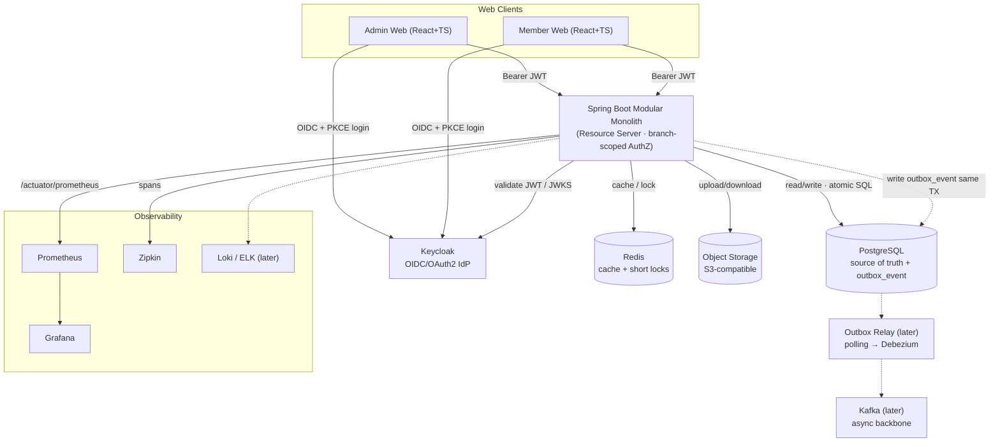

# Kiến trúc giải pháp (Solution Architecture)

> Bản tiếng Việt (canonical). English: [`../../en/architecture/solution-architecture.md`](../../en/architecture/solution-architecture.md).
> Sơ đồ chuẩn: [`diagrams/solution_architecture.svg`](../../diagrams/solution_architecture.svg)
> Trạng thái: ĐỀ XUẤT — đã khớp sơ đồ của owner.

## 1. Mục đích
Kiến trúc kỹ thuật mục tiêu của gym-platform. Vẫn là **Spring Boot Modular Monolith** (một backend triển khai). Hạ tầng hỗ trợ: **Keycloak** (xác thực/OIDC), **PostgreSQL** (nguồn sự thật), **Redis** (cache + lock ngắn hạn), **Object Storage** (tương thích S3, tài liệu/ảnh), **Transactional Outbox** (dùng ngay), và **Kafka** làm xương sống bất đồng bộ (**triển khai sau**). Quan sát qua **Prometheus + Grafana** và **Zipkin** (+ Loki/ELK cho log sau này). Không cái nào là microservices.

## 2. Nguyên tắc kiến trúc
- Modular Monolith trước: một app Spring Boot, module dưới `com.gym.*`.
- Luồng lõi (thanh toán, hợp đồng, booking, check-in, quota, kho) giữ **nhất quán mạnh** bằng **transaction PostgreSQL + atomic SQL / constraint**.
- **Xác thực** giao cho Keycloak. **Phân quyền theo chi nhánh nằm trong module `identity` nội bộ** (role · phạm vi chi nhánh · quyền sở hữu · quyền hạt mịn).
- **Redis** lo phần ephemeral, nhạy hiệu năng (QR token TTL, nonce một lần, lock chống quét trùng, rate limit). **Uniqueness bền vững vẫn ở PostgreSQL** (vd 1 trial/CCCD, payment txn id).
- **Object Storage** chứa tài liệu nhị phân; DB chỉ lưu **object key/URL**.
- Tác vụ phụ async được **ghi nhận ngay** qua **Transactional Outbox**; phần phát đi bằng **Kafka** thêm vào **sau** mà không phá vỡ điểm nối.

## 3. Bối cảnh tổng thể

## 4. Thành phần luận lý

| Thành phần | Trách nhiệm | Now/Later |
|---|---|---|
| Admin/Member Web | SPA React+TS, đăng nhập OIDC (PKCE) | now |
| Keycloak | Xác thực, token, MFA, phiên | now |
| API Monolith | Module nghiệp vụ, resource server, phân quyền theo chi nhánh | now |
| PostgreSQL | Nguồn sự thật + `outbox_event` | now |
| Redis | Cache + lock ngắn (QR TTL, nonce, chống quét trùng, rate limit) | now |
| Object Storage (S3) | Ảnh CCCD/thẻ SV, contract PDF, hóa đơn, media | now |
| Transactional Outbox | Ghi domain event trong cùng TX nghiệp vụ | now |
| Outbox Relay + Kafka | Phát đi + xương sống async (notification, audit, report, CRM) | **later** |
| Prometheus / Grafana | Metrics + dashboard/cảnh báo | now |
| Zipkin | Tracing phân tán | now |
| Loki / ELK | Log tập trung | **later** |

## 5. Xác thực & Phân quyền
**Keycloak = xác thực; app = phân quyền (đã được sơ đồ kiến trúc xác nhận).**
- Realm `gym-platform`; client `gym-admin-web`, `gym-member-web` (public + PKCE); API = **resource server** OAuth2 kiểm tra JWT qua JWKS.
- App ánh xạ `sub` trong JWT → principal nội bộ, rồi **module `identity`** thực thi: **Role · Phạm vi chi nhánh · Quyền sở hữu · Quyền hạt mịn** dựa trên `rbac_*` + `staff_branch_assignment`.
- App DB không lưu mật khẩu; `identity_user_account` ánh xạ id nội bộ ↔ `keycloak_user_id`. (Xem `data-model/p1-identity-org.md`.)

## 6. Kho dữ liệu & hỗ trợ runtime
- **PostgreSQL** — nguồn sự thật: bảng nghiệp vụ, constraint & index, transaction ACID, atomic SQL. Chứa `outbox_event`.
- **Redis** — cache & lock ngắn hạn: **QR token TTL**, **nonce một lần**, **lock chống quét trùng**, **rate limit**. Lớp hiệu năng/ephemeral; **không** thay thế constraint bền vững của DB. Bảo vệ race condition có thẩm quyền (trial 1 lần/CCCD, idempotency thanh toán, uniqueness đặt lớp, kho/quota) vẫn ở PostgreSQL (xem `CLAUDE.md`).
- **Object Storage (S3)** — ảnh CCCD/thẻ SV, contract PDF, hóa đơn/biên nhận, ảnh thiết bị/sản phẩm. DB chỉ lưu object key/URL; object nhạy cảm kiểm soát qua RBAC và audit khi đọc/ghi.

## 7. Sự kiện bất đồng bộ — Outbox trước, Kafka sau
- **Bây giờ**: module nghiệp vụ ghi event vào **`outbox_event`** trong **cùng transaction DB** với thay đổi nghiệp vụ → "event được ghi khi và chỉ khi thay đổi đã commit". Không mất event ngay cả khi chưa có Kafka.
- **Sau này**: **Outbox Relay** (polling trước, **Debezium CDC** sau) publish event đã commit lên **Kafka** để consumer async xử lý (notification, audit, report, CRM). Consumer phải **idempotent**.
- Quyết định lõi cần nhất quán **không bao giờ** đưa sang Kafka — vẫn transactional trong PostgreSQL. Kafka chỉ chở sự kiện kết quả.

## 8. Quan sát (Observability)
Metrics: Micrometer/Actuator `/actuator/prometheus` → **Prometheus** → **Grafana** (JVM, HTTP, DB pool, KPI nghiệp vụ; Kafka lag sau). Tracing: Micrometer Tracing (Brave/OTel) → **Zipkin**, lan truyền context qua HTTP (và Kafka sau). Log: có cấu trúc kèm `traceId`/`spanId`; tập trung **Loki/ELK sau**.

## 9. Hạ tầng dev local
`infra/docker/docker-compose.yml` cung cấp: `postgres`, `pgadmin`, `keycloak`, `redis`, `minio` (S3) + `minio-setup`, `prometheus`, `grafana`, `zipkin`. **Kafka hoãn lại** (khối comment). App Spring chạy trên host (cổng 8080); Keycloak map sang 8085 để tránh đụng cổng.

## 10. Trạng thái quyết định
| # | Quyết định | Trạng thái |
|---|---|---|
| 1 | Hybrid: Keycloak authN + app phân quyền theo chi nhánh | ✅ Sơ đồ đã xác nhận |
| 2 | Async: Outbox dùng ngay, Kafka sau (polling → Debezium) | ✅ Theo sơ đồ |
| 3 | Redis cho cache + short lock (uniqueness bền vững ở PostgreSQL) | ✅ → ADR-0009 |
| 4 | Object Storage (S3) cho tài liệu/ảnh; DB chỉ lưu object key | ✅ → ADR-0010 |
| 5 | Cập nhật baseline CLAUDE.md với hạ tầng hỗ trợ đã duyệt | ✅ |

ADR: **0006** Keycloak · **0007** Outbox-now/Kafka-later · **0008** Observability · **0009** Redis · **0010** Object Storage · **0011** Schema-per-module.
